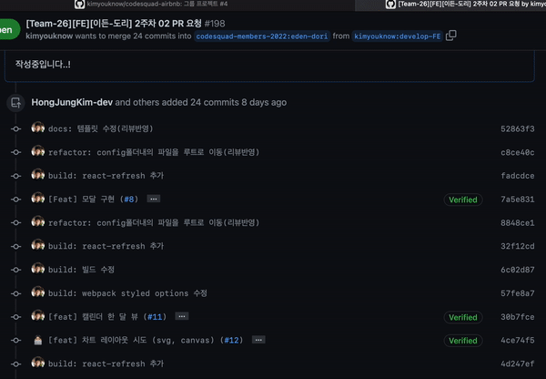
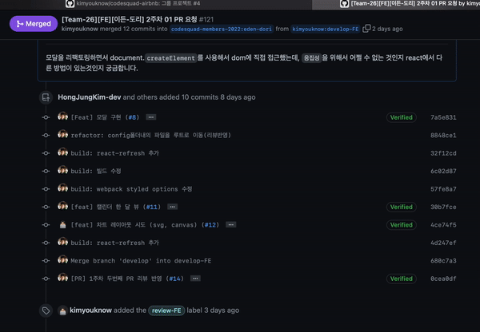

# 5월 5주차 (6월 1주차) 주간회고

# 코드스쿼드

> 브랜치 최신화, 다른 사람코드, 홈커밍데이

### 다른 사람 코드

코딩마라톤이라는 방식으로 1주일 넘게 프로젝트를 진행하면서 느낀 점.

**요약**

이미 구현된 코드를 내가 이어서 작업하려다보니까 다른 사람 코드를 수정하는 일이 얼마나 어려운지 느꼈다. 다른 사람도 내 코드를 보고 어렵다고 느낄 수 있으니 변수명과 함수명을 고민하고 흐름을 이해하기 쉽게 짜야한다고 느꼈다. `어떻게든 동작하게 하는 코드는 누구나 짤 수 있지만 이해하기 쉽고, 수정이 용이하게 코드를 짜는 건 어렵다.` 이번 경험을 통해, 작은 기능을 구현하더라도 글쓰기 과제 제출하는 것처럼 `코드를 다듬는 과정`을 반드시 거처야한다고 느꼈다.

**장점**

아무래도 시간이 지나면 구현한 것을 다른 팀원에게 전달해야하기 때문에 시간이 다가와도 추가적으로 기능을 더 많이 하려는것보다 매직넘버를 제거하고 버그 수정을 하려고 노력하게 되었다. 최대한 다른 팀원이 추가적으로 수정시에 매직넘버가 있으면 코드를 이해하는데 시간이 오래걸리고 수정하기도 어렵기 때문이다.

- 이전까지는 `다른 사람 코드를 보고 수정하는 일`을 경험해보지 못했는데 좋은 경험이 되었습니다.
- 다른 사람 코드에 이어서 작업하는 일은 단순히 코드를 읽는 것보다 훨씬 어려웠습니다. 읽고 이해했다고 생각한 코드도 막상 작업을 해보니 이해하지 못한 부분이 많았습니다.
- 다른 사람이 넘겨받을 상황을 고려해 `네이밍(변수명, 함수명)`에 대해 더 고민하게 되었습니다.
- 코드만 보고 로직을 쉽게 이해할 수 없다고 생각해 코드를 짜면서 했던 `고민과 설계를 문서화`해서 정리해봤습니다.

**단점**

변수명, 매직넘버 등을 더 고민하다보니 혼자 구현하는 것보다 시간이 오래 걸렸다.

- 혼자할 때보다 `구현속도`가 더뎠습니다. 만약에 하나를 혼자 맡았으면 일부 로직을 처음에 헤매도 이후에 해결하고 탄력을 받아서 이어서 금방 할 수도 있었지만 중간에 서로 구현하던것을 바꿔서 하다보니 `새로 맡은 것에 몰입하는데도 시간`이 걸렸습니다.
- `이미 구현된 코드를 이어서 작업하는게 얼마나 어려운지 느꼈습니다.` 서로 코드를 수정하는 일에 거리낌 없었지만 이미 구현된 로직을 살려서 기능을 추가하는 일이 어려웠습니다. (로직을 마음대로 바꾸면 혼자하는 거랑 다른게 없다고 느껴서 기존 로직을 이어서 진행했습니다.)

**과정**

서로 핑퐁하기 전에 각자의 코드에 대해서 그림과 함께 설명하였다. 설명 없이 각자 서로의 코드를 보면서 이해하고 작성하는것이 가장 좋지만 그렇기에는 너무 어렵고 시간이 지나치게 오래걸릴것이라고 생각하였다. 현업에서는 이전에 짜여진 코드를 이해하는것이 쉽지 않을것이라고 생각하였다. 이전 코드를 짠 분이 계시면 물어봐가면서 할 수 있지만 않계시다면 그 코드를 정말 이해하기 어려울 수 있을것 같다는 생각이 들었다.

최대한 전에 작성한 팀원의 코드 로직을 그대로 따라서 구현하고자 하였고, 그것이 어려우면 새로 설계하는것 및 코드 수정은 자유롭게 하는것으로 팀원과 규칙을 정하여 진행하였다.

구현 기간을 길게 가진 경우 서로 PR에 리뷰만 달고 리뷰 반영은 따로 하지않았다. 서로 바꿔서 이어서 구현하는 방식을 더 연습하여 서로의 코드를 이해하고 그 이해를 바탕으로 이어서 구현해보고 싶었기 때문이다.

**개선하고 싶은점**

구현 기간을 더 짧게 가져서 서로 핑퐁하는 수를 늘리는것이 좋겠다고 생각하였다. 그렇게 되면 리뷰하여 반영하는 시간도 날 수 있을것이다.

### 홈커밍데이

취업한 수료생 3분과 대화를 나눴다.

- 모두 어떤 문제를 어떻게 해결했는지 과정을 어필 (문제해결능력)
- 블로그는 꼭 기술적인 부분이 아니더라도 스토리 텔링 형식으로 문제를 어떻게 해결했는지 기술해도 좋음.
- 면접볼 때, 본인이 쓴 블로그 글에 대한 질문에 대답하지 못하면 마이너스
- 의사소통을 능력을 어떻게 어필하지? 프로젝트 경험에서 겪은 어려움을 어떻게 해결했는지로 어필해야할까?
- 프론트엔드는 생각보다 완전 어려운 기술은 없다. 어떤 기술을 썼는지 집착했는지보다 사용자 경험을 중요시해라. 백엔드와 다르게 성능문제, 아키텍처처럼 해결하지 못할 문제는 드물다.

### 브랜치 최신화

rebase와 merge 차이를 upstream에 pr보내면서 차이점을 알아봤다.

다음과 같은 브랜치 구조가 있을 때,

```bash
└── **team26(eden-dori)**
		└── develop
		     ├── develop-FE
		     │    ├── FE/feature/#12-login_page
		     │    └── FE/feature
		     └── ****develop-BE ****
		          ├── BE/feature
		          └── BE/feature
```

`upstream/eden-dori`에서 `origin/develop`로는 `rebase`했지만

`origin/develop`에서 `origin/devleop-FE`로 최신화할 때 rebase를 안해서(`merge`함) 기록이 남아있었다.

<details>
<summary>6/3일자 커밋로그</summary>

- https://github.com/codesquad-members-2022/airbnb/pull/198
- 

</details>

<details>
<summary>6/3일자 커밋로그</summary>
- https://github.com/codesquad-members-2022/airbnb/pull/121 
- 

</details>

`두 날짜를 비교해보면 표시한 부분만큼 쌓이고 있음. ⇒ develop-FE도 rebase해야함`


