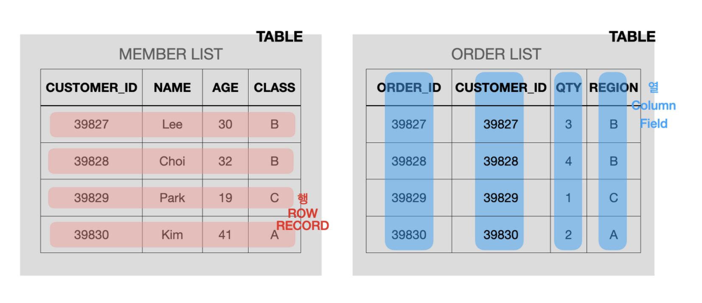

# 데이터베이스 개념

## 기본 개념

### 데이터베이스란?

- 일정한 규칙, 혹은 규약을 통해 구조화되어 있는 데이터의 모음
- `Database Management System(DBMS)`: 전산 데이터베이스의 생성과 유지보수를 용이하게 하는 소프트웨어 패키지 및 시스템
- `실시간 접근성(Real-Time Accessibility)`: 실시간 처리에 의한 응답이 가능해야 한다.
- `계속적인 변화(Continuous Evolution)`: 새로운 데이터의 삽입(Insert), 삭제(Delete), 갱신(Update)로 항상 최신의 데이터를 유지한다.
- `동시 공용(Concurrent Sharing)`: 다수의 사용자가 동시에 같은 내용의 데이터를 이용할 수 있어야 한다.
- `내용에 의한 참조(Content Reference)`: 데이터베이스에 있는 데이터를 참조할 때 사용자의 요구에 따른 데이터 내용으로 데이터를 찾는다.

### SQL

- `구조화된 질문 언어`
- SQL은 데이터베이스에 접근하고 이용하기 위한 언어
- DBMS와 개발자가 소통하는 수단
- DBMS에 따라 조금의 차이는 있지만, 대부분 유사한 문법을 따름

### 엔터티란?

- 사람, 장소, 물건 ,사건, 개념 등 여러 개의 속성을 지닌 명사
- 사람, 장소, 사물, 사건 등과 같이 `독립적으로 존재하면서 고유하게 식별이 가능한 실세계의 객체`. (ex) 과목 코드가 F035 인 자료구조 등.
- 약한 엔터티: 혼자서 존재하지 못하는 엔터티 (Ex: 문)
- 강한 엔터티: 혼자 있어도 존재할 수 있는 엔터티 (Ex: 건물)

### 릴레이션

- 데이터베이스에 `정보를 구분하여 저장하는 기본 단위`
- 테이블 중 데이터베이스에서 사용되기 위한 조건을 갖춘 것
- 제약 조건
  - 테이블의 cell은 단일 값을 갖는다
  - 어떤 두 개의 row도 동일하지 않다.
- 관계형 데이터베이스 : 테이블
- no sql : 컬렉션

### 속성

- 릴레이션에서 관리하는 구체적이고 고유한 이름
- column, attribute

### 도메인

- 릴레이션에 포함된 각각의 속성들이 가질 수 있는 값의 집합

## 필드와 레코드, 타입

### 필드 Field

- 엑셀에서 열 `column`에 해당하는 가장 작은 단위의 데이터
- `엔티티의 속성을 표현`

### 레코드 Records (튜플 Tuple)

- 레코드 Record는 `논리적으로 연관된 필드의 집합`을 의미
- 엑셀의 행 `row`에 해당
- 튜플 Tuple 이라고 불리기도 함.
- 여기서 각각의 필드는 특정한 데이터 타입과 크기가 지정되어 있다.
- 여러 행이 모여 한 열을 이루듯이 여러 필드가 모여 한 레코드를 이룬다.

### 엔티티와 레코드의 차이점 (Entity vs Records)

- `레코드`: 실제 데이터베이스 상에 저장되어 있는 값들의 **집합**
- `엔티티`: 현실 세계에 존재하는 객체를 표현하기 위해 비유(추상)적으로 사용
- https://stackoverflow.com/questions/26820023/difference-between-entity-and-record#:~:text=%22A%20collection%20of%20fields%20that,database%20is%20an%20%22entity%22.

### 필드와 특성의 차이점 (Field vs Attribute)

- 데이터베이스에서 필드와 특성은 본질적으로 같은 것을 의미 (= 엔티티의 특수한 성질을 의미)
- 고객 엔티티에서 customer_id, name, age, class는 고객이라는 엔티티의 고유한 특성이다. 이 특성들은 다른 테이블/엔티티와의 관계에 대해 이야기할 때, 필드(Field)라고 불려질 수 있다.

- ['What is the difference between a field and an attribute in context of storing data?' - Quora](https://www.quora.com/What-is-the-difference-between-a-field-and-an-attribute-in-context-of-storing-data)

### 테이블 Table (파일 Files)

- 서로 연관된 레코드의 집합

### 타입

- 필드마다 같은 타입
- 타입은 DBMS에 따라 다름 (아래 예시는 MYSQL기준)
- 숫자(INT): 4bytes, -21억 ~ 21억 (cf. medium int, big int ...)
- 날짜
  - DATE: 날짜 O, 시간 X, 3bytes
  - DATETIME: 날짜 O, 시간 O, 8bytes
  - TIMESTAMP날짜 O, 시간 O, 4bytes, 1970-01-01 00:00:01 기준의 count값
- 문자
  - CHAR: 0 ~ 255 사이의 고정값, 4바이트씩 저장
  - VARCHAR: 0 ~ 65,535 사이의 가변길이 문자열, 입력된 데이터에 따라 용량을 가변시켜 저장
  - TEXT: 큰 문자열 저장
  - BLOB: 이미지, 동영상 등 큰 데이터 저장, 잘 안씀
  - ENUM: 문자열을 열거한 타입, 0,1 등으로 매핑하여 메모리 적게 사용, 최대 65,535개 사용가능
  - SET: 문자열을 열거한 타입, 비트 단위의 연산 가능, 최대 64개 사용가능

## 관계와 키

출처: https://www.lucidchart.com/pages/ER-diagram-symbols-and-meaning

- '|' 표시가 있는 곳은 반드시 있어야 하는 개체. (필수)
- 'O' 표시가 있다면 없어도 되는 개체. (선택)

### 관계

- One to one : 1 대 1 대응
  - 학생: 신체정보
- One to many : 1 대 N 대응
  - 학생: 취미
- Many to many : N 대 M 대응
  - 학생 : 강의
  - 테이블 두 개를 직접 연결하지 않고, 1: N, 1: M이라는 관계를 갖는 테이블 두개로 나눠서 연결

### 키

- 테이블 간의 관계를 명확하게 하기 위한 장치
- 테이블 자체의 인덱스를 위해 설정
- 검색, 정렬시 Tuple을 구분할 수 있는 기준이 되는 Attribute.

- 유일성: 중복되는 값이 없다.
- 최소성: 필드를 조합하지 않고 최소 필드만 써서 키를 형성할 수 있다.

- 기본키: PK(primary key)
  - 유일성과 최소성을 만족
  - 자연키 혹은 인조키로 설정
- 자연키
  - 언제가는 변하는 속성
- 인조키
  - 인위적으로 생성한 속성
- 외래키: FK(foreign key)
  - 다른 테이블의 기본키를 그대로 참조하는 값
  - 개체와의 관계를 식별하는데 사용
  - 중복 가능
  - 필드와 레코드에서 설명한 그림을 참고하면 주문목록에 있는 customer_id가 외래키다.
- 후보키(Candidate key)
  - 기본키가 될 수 있는 후보
  - 유일성과 최소성을 만족
- 대체키(Alternate key)
  - 후보키가 두 개 이상일 경우 어느 하나를 기본키로 지정하고 남은 후보키들
- 슈퍼키(Super key)
  - 각 레코드를 유일하게 식별할 수 있는 유일성을 갖춘 키

## 참고자료

- 면접을 위한 CS 전공지식 노트 - 주홍철
- https://opentutorials.org/course/3162
- https://github.com/Seogeurim/CS-study/tree/main/contents/database
- https://github.com/gyoogle/tech-interview-for-developer#database
- https://inpa.tistory.com/entry/DB-📚-데이터-모델링-1N-관계-📈-ERD-다이어그램
