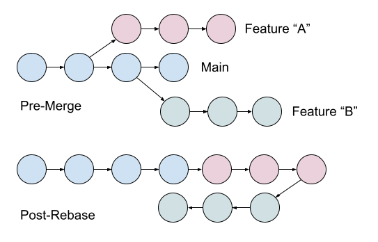
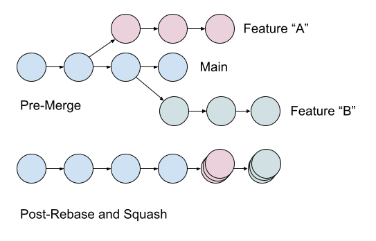
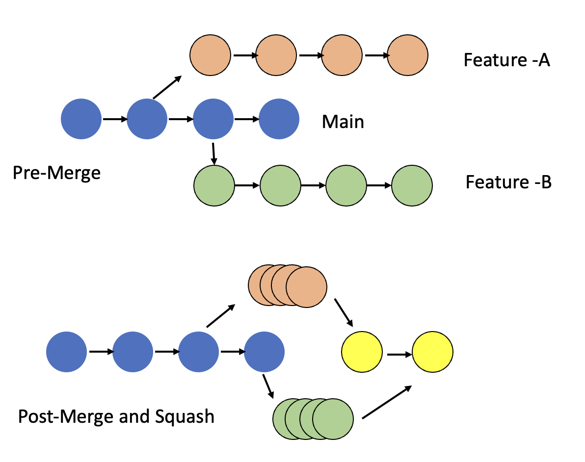

# Rebase & Merge (feat. squash)

> 정리중...

rebase랑 squash 차이가 뭘까? 둘다 커밋로그 깨끗하게 해주는 거 아님?

[https://jamie-log.notion.site/44f486cda33b411cb15759e392925908](https://jamie-log.notion.site/44f486cda33b411cb15759e392925908)

[https://icerabbit.tistory.com/76](https://icerabbit.tistory.com/76)

[https://brunch.co.kr/@anonymdevoo/7](https://brunch.co.kr/@anonymdevoo/7)

[https://sabarada.tistory.com/196](https://sabarada.tistory.com/196)

[https://medium.com/swlh/squash-and-rebase-git-basics-5cb1be1e0dac](https://medium.com/swlh/squash-and-rebase-git-basics-5cb1be1e0dac)
