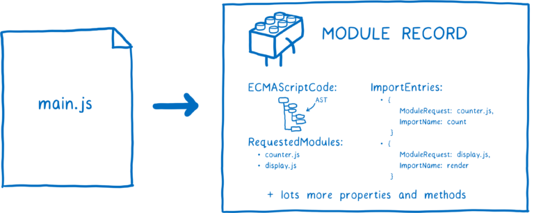
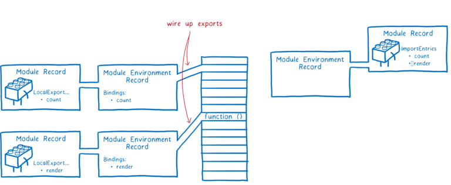
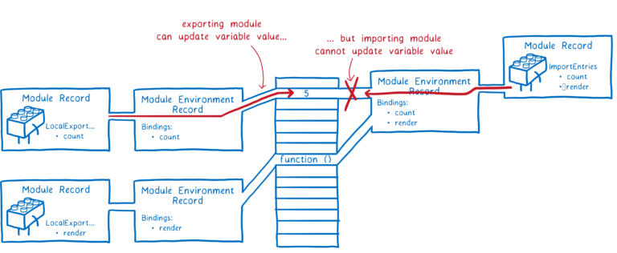

# 자바스크립트 모듈 (깊게 이해하기)

nodejs를 공부하다보니 require문을 자주 보게되었다. 나는 브라우저에서 동작하는 코드를 많이 작성하던 편이어서 es6를 주로 사용했다. (es모듈은 자바스크립트 표준화된 모듈 시스템으로 브라우저에서 지원한다.) nodejs도 버전 13.2부터 es모듈 시스템에 대한 정식 지원을 시작했지만, 파일 확장자를 `mjs`로 바꾸거나 packge.json의 최상위 `type을 module`로 설정해야한다. 하지만 `es6 이상의 최신 자바스크립트 문법`으로 작성된 코드가 nodejs에서 실행되지 않은 경우가 종종 있어 `babel`을 활용하여 개발을 주로 하고 있다.

모듈 시스템이 익숙해서 사용하고 있지만 es모듈이 어떻게 동작하는지 이해해본적은 없다.

특히 이번에 jest를 공부하게 되면서 import /export 관한 에러가 났는데, 구글링 통해 문제는 해결했는지만 원인과 해결방법을 이해하지 못했다. module과 reuqire, import문 사용에 따라 차이가 있어 관련 주제를 학습해보려고 한다.

[자바스크립트 모듈과 export/import](https://kimyouknow.gitbook.io/til/js/undefined/export-import)는 여기를 참고해주세요.

# 요약

### 모듈

- 모듈은 스코프와 변수와 관련있다. 모듈을 활용하면 변수와 함수를 모듈 스코프라는 특정 공간에 넣어 모듈 내의 스코프에서 활용할 수 있으며, export 기능을 활용해 다른 모듈에서도 사용 가능하다.
- 전역변수가 아닌 자신만의 스코프를 가진다.
- 특정 모듈을 여러 곳에서 사용되더라도 한 번만 평가된다.
- 번들링툴을 사용하면 하나 혹은 여러개의 파일로 번들링 된다.

### 모듈동작방식

- esm과 commonJS는 다르게 동작한다.

**esm**

- 구성, 인스턴스화, 평가 세 단계가 독립적으로 수행가능하다.
- 라이브 바인딩을 통해 export 한 모듈에서 값을 변경하면 import한 모듈에 반영된다. (같은 메모리주소)

**commonJS**

- 모듈과 그 아래의 의존성이 로드되고, 인스턴스화 되어 한꺼번에 모든 평가가
- 파일 시스템에서 파일을 로드한다.
- node에서는 스크립태그가 없으므로 type속성을 package.json에서 주거나 .mjs 확장자를 사용한다.
- export 객체를 내볼 때 복사한다. (import하는 곳에서는 사본을 사용한다. 다른 메모리주소)

> 사진 예시는 [toastUI](https://ui.toast.com/weekly-pick/ko_20180402)에서 코드 예시는 [javascript-info](https://ko.javascript.info/modules-intro)에서 가져왔습니다.

# 모듈이 어떤 문제를 해결할까?

`모듈은 스코프와 변수와 관련이 있다`.

변수에 값을 할당하고, 변수를 수정하는 등 코드 작업의 상당 부분은 변수를 변경하는 부분이 차지한다. 이런 변수들을 얼마나 잘 관리하는지가 코드를 얼마나 잘 작성하는지, 얼마나 쉽게 유지 보수할 수 있는지에 많은 영향을 미친다.

모듈을 활용하면 `변수와 함수를 모듈 스코프라는 특정 공간에 넣어 모듈의 함수 사이에서 변수를 공유`할 수 있다. 또한, `export기능을 활용해 다른 모듈에서도 사용 가능`하게 한다.

간단히 전역스코프로 변수를 관리할 수 있지만 로직이 파악이 어렵고 유지보수를 어렵게 한다. ( 구체적인 이유에 대해선 따로 정리해보자)

### 모듈 간에 변수를 내보내고(export) 가져올 수(import) 있게 되면 어떤 장점이 있을까?

코드들을 각각 독립적으로 작동할 수 있는 단위로 나누기 수월해진다. 그다음 레고 블록을 조립하듯 이런 코드 조각들을 조합해서 같은 모듈들의 모음으로 다양한 종류의 애플리케이션을 만들 수도 있다.

함수 스코프를 사용하여 변수와 함수를 관리할 수 있다. 하지만 `함수 범위와 달리 모듈 범위는 변수를 다른 모듈에서도 사용할 수 있는 방법을 제공`한다. (export 기능을 활용해 외부에서 어떤 변수, 클래스 함수를 사용할지 알려줄 수 있다.)

현재 Node.js가 오래전부터 사용해오던 `CommonJS(CJS`)가 있고, `ESM(EcmaScript modules)`라는 자바스크립트 명세에 추가된 최신의 모듈 시스템이 있다. 브라우저는 이미 ES 모듈을 지원하며 Node.js는 ES 모듈 지원을 추가 중이다.

# 1. 모듈의 특징

단지 파일 하나를 의미한다. 스크립트 하나는 모듈 하나라고 할 수 있다.

## 1-1. 전역변수가 아닌 자신만의 스코프를 가진다.

아래처럼 module로 타입으로 받아오면 크롬 콘솔에서 전역변수에 접근할 수 없음

- `모듈은 자신만의 스코프가 있어서 모듈 내부에서 정의한 변수나 함수는 다른 스크립트에서 접근할 수 없다.`
- 따라서, 모듈은 최상위 레벨 this는 undefined이고, 모듈이 아닌 일반 스크립트의 this는 전역 객체다.

```html
<script type="module" src="b.js"></script>
<!-- this 테스트 -->
<script>
  alert(this); // window
</script>

<script type="module">
  alert(this); // undefined
</script>
```

```jsx
// b.js
const hello = 'const b';
// const const_a = 'dubplicated a';

console.log(hello);
console.log('test'); // 둘다 출력은 양호 하지만 콘솔에서 접근 안 됨.
```

## 1-2. 모듈은 여러 곳에서 사용되더라도 단 한 번만 평가된다.

```jsx
// console.js
conosle.log('모듈 평가 완료');

// 동일한 모듈 여러 모듈에서 사용하기
// a.js
import './console.js';

// b.js
import './console.js';
// 콘솔에는 한 번만 표시됨.
```

아래 예시와 같이 전역변수를 관리하는 느낌으로 사용 가능

이런 특징을 이용하면 `모듈설정(configuration)`을 쉽게 할 수 있다. 최초로 실행되는 모듈의 객체 프로퍼티를 원하는 대로 설정하면 다른 모듈에서 이 설정을 그대로 사용할 수 있기 때문이다.

```jsx
// <script type="module" src="a.js"></script>
// <script type="module" src="b.js"></script>

// console.js
export const admin = {
  name: '도리',
};

// 동일한 모듈 여러 모듈에서 사용하기
// a.js
import { admin } from './inside.js';
admin.name = '크롱';
// b.js
import { admin } from './inside.js';
console.log(admin.name);
// 콘솔에는 크롱이 출력
```

## 1-3. import.meta

> import.meta 객체는 현재 모듈에 대한 정보를 제공해줍니다.

호스트 환경에 따라 제공하는 정보의 내용은 다른데, 브라우저 환경에선 스크립트의 URL 정보를 얻을 수 있습니다. HTML 안에 있는 모듈이라면, 현재 실행 중인 웹페이지의 URL 정보를 얻을 수 있습니다.

## 1-4. 브라우저에서 특정 기능

모듈 스크립트는 항상 지연 실행된다. 외부 스크립트, 인라인 스크립트 관계없이 마치 `defer`속성을 붙인 것처럼 실행된다.

- 외부 모듈 스크립트 `<script type="module" src="...">`를 다운로드할 때 브라우저의 HTML 처리가 멈추지 않는다. `브라우저는 외부 모듈 스크립트와 기타 리소스를 병렬적으로 불러온다`.
- 모듈 스크립트는 HTML 문서가 완전히 준비될 때까지 대기 상태에 있다가 HTML 문서가 완전히 만들어진 이후에 실행된다. 모듈의 크기가 아주 작아서 HTML보다 빨리 불러온 경우에도 동일하다.
- `스크립트의 상대적 순서가 유지`된다. 문서상 위쪽의 스크립트부터 차례로 실행한다.

## 1-5. 인라인 스크립트 비동기처리

### async 속성 활용

`모듈 스크립트에선 async 속성을 인라인 스크립트에도 적용 가능`하다. async 속성이 붙은 스크립트는 로딩이 끝나면 다른 스크립트나 HTML 문서가 처리되길 기다리지 않고 바로 실행한다.

- 아래와 같은 인라인 스크립트엔 async속성이 있어 다른 스크립트나 html이 처리되길 기다리지 않고 바로 실행된다.
- 이런 특징을 활용해 광고나 문서 레벨 이벤트 리스너, 카운터와 같이 어디에도 종속되지 않은 기능을 구현할 때 유용하게 사용 가능

```jsx
<!-- 필요한 모듈(analytics.js)의 로드가 끝나면 -->
<!-- 문서나 다른 <script>가 로드되길 기다리지 않고 바로 실행됩니다.-->
<script async type="module">
  import { counter } from './analytics.js';

  counter.count();
</script>

```

## 1-6. 빌드 툴

번들링 툴을 사용하면 스크립트들은 하나 혹은 여러 개의 파일들로 번들링된다. 이 때 `import, export문은 번들러 함수로 대체`된다. 따라서 `type=module`이 필요 없어지게 됨.

# 2. ES 모듈의 동작 방식

모듈을 사용한다면 `import 문으로 연결된 파일을 통해 브라우저 혹은 node가 어떤 코드를 불러와야하는지 인식한다`. 첫 파일이 entry point가 되고 import문을 따라 의존성 그래프가 작성된다.

여러 js파일이 있을 때, 브라우저가 파일 자체를 사용할 수 있는 것이 아니다. `모듈 레코드`라고 하는 데이터 구조로 변환하려면 이 파일들을 모두 구문분석하고, 모듈 레코드를 모듈 인스턴스로 변환해야 한다. `모듈 인스턴스`는 명령어 목록인 코드와 특정 시점의 실제 변수 값인 상태를 결합한다.

각 모듈에 대한 모듈 인스턴스가 필요하다. 모듈을 불러오는 과정은 entry 파일이 모듈 인스턴스의 전체 그래프를 그리는 것으로 진행된다.

ES6 모듈의 경우 세 가지 단계로 나뉘어 진행된다.

1. `구성` - 모든 파일을 찾아 다운로드하고 모듈 레코드로 구문분석한다.
2. `인스턴스화` - export 된 값을 모두 배치하기 위해 메모리에 있는 공간들을 찾는다(아직 실제 값은 채우지 않음). 그다음 export와 import들이 이런 메모리 공간들을 가리키도록 한다. 이를 연결(linking) 이라고 한다.
3. `평가` - 코드를 실행하여 상자의 값을 변수의 실제 값으로 채운다.


## 2-1. ES모듈은 비동기식일까?

모듈화 작업은 구성, 인스턴스 화 및 평가 세 단계로 나뉘어있으며 독립적으로 수행될 수 있기 때문이다. 하지만 CommonJS는 ES모듈과 다르게 의존성이 로드되고, 인스턴스화 되어 한꺼번에 모든 평가가 이뤄진다.

`ES모듈`

- 구성, 인스턴스화 및 평가 세 단계로 나뉘어있으며 독립적으로 수행가능
- [ES 모듈 명세](https://tc39.github.io/ecma262/#sec-modules)는 모듈 레코드에 파일을 구문분석하는 방법과 인스턴스 화 하는 방법, 그리고 그 모듈을 평가하는 방법을 알려준다. 하지만 파일을 처음에 어떻게 얻는지는 말하고 있지 않다. 따라서 반드시 비동기적인 것은 아니다.
- 위의 3가지 방법 외에 파일을 어떻게 불러오는지는 `로더(loader)`가 수행하는데, 로더는 다른 명세로 구성되어 있다.
- 로더의 경우 html 명세를 따르는데 사용중인 플랫폼에 따라 다른 로더를 가질 수 있다.

`CommonJS`

- 모듈과 그 아래의 의존성이 로드되고, 인스턴스화 되어 한꺼번에 모든 평가가 이뤄짐.


## 2-2. ES6 모듈의 경우 세 가지 단계

## 2-2-1. 구성

- 모듈이 들어있는 파일을 어디서 다운로드 할 것인지 확인한다(module resolution이라고도 함).
- 파일을 가져온다(URL을 통해 다운로드 하거나 파일 시스템에서 불러옴).
- 파일을 모듈 레코드로 구문분석한다.

### 파일 찾기 및 가져오기

1. 로더가 파일을 찾아서 다운르도한다. 그러기 위해 `진입점(entry point)`파일을 찾아야 한다. (HTML에서는 스크립트 태그를 사용해서 로더에게 어디에서 진입점 파일을 찾을 수 있는지 알려준다. )
2. import문의 한 부분을 모듈지정라고 하는데, 이것을 통해 로더가 어디서 다음 모듈을 찾아야할지 알려준다. (하나의 파일을 구문분석한 다음 트리의 의존성을 파악하고, 해당 의존성을 찾아 불러와야 한다)

주 스레드가 모든 파일들을 각각 다운로드할 때까지 대기해야 한다면 많은 작업이 대기열에 쌓일 수 있다. (`브라우저에서 작업할 때 다운로드 시간이 가장 긴 이유`) 이를 해결하기 위해, es모듈 명세가 알고리즘을 여러 단계로 나눈 이유이다. 구조 단계를 각 단계로 나눈다면 인스턴스 화 작업을 동기적으로 처리하기 전에, 브라우저가 파일을 불러오고 모듈 그래프를 구성한다.

### 📍 CommonJS모듈과 ES모듈의 가장 큰 차이: 각 단계 나누기

CommonJS는 `파일 시스템에서 파일을 로드`하므로, 인터넷을 통해 다운로드하는 것보다 시간이 빠름. 즉, `node는 파일을 불러오는 동안 주 스레드를 차단한다.` ES모듈과 다르게 파일이 이미 로드되어 있으므로 바로 인스턴스화하고 평가하면 된다.

따라서, CommonJS 모듈을 사용하는 Node에서 모듈 지정자에 변수를 사용할 수 있음.

```jsx
// 1. CommonJS모듈 ✅
require(`${path}/counter.js`).count;
// 2. ES모듈 ❌
import {count} from `${path}/counter.js`;
// 3. ES 모듈 동적 import
import(\\${path}/foo.js)`; // 동적으로 import 한 모듈은 새로운 그래프를 시작하고 별개로 처리

```

### 파싱 (모듈맵)

파일 불러오기 이후 해당 내용을 모듈 레코드로 해석해야한다. 이를 통해 브라우저가 모듈의 다른 부분이 무엇인지 이해하게 한다.



모듈 레코드가 한번 만들어지고 나면, 그 레코드는 모듈맵에 추가된다. 그다음부터는 필요할 때 마다 로더가 모듈맵에서 가져올 수 있다는 것을 의미한다.


### 📍 CommonJS모듈과 ES모듈의 type=module차이

브라우저에서는 type="module"을 스크립트 내부에 적어두면 브라우저에 이 파일은 모듈로 구문분석 되어야 한다고 알려줄 수 있다.

Node에서는 HTML 태그를 사용하지 않으므로 type 속성을 사용할 수 있는 옵션이 없다. Node 커뮤니티는 이를 해결하기 위한 한 가지 방법으로 `.mjs`확장자를 고안했다고 한다.

node든, 브라우저든 로더는 파일을 모듈로 구문 분석할지 결정한다. 어떤 파일이 모듈이며 import 문이 있다면 모든 파일을 불러와서 구문분석하는 단계를 계속 수행한다. 불러오기 단계가 끝나면, 우리는 진입점 파일부터 시작해서 모듈 레코드의 묶음을 얻게 된다.

## 2-2-2. 인스턴스화

> 인스턴스는 코드와 상태를 결합. 상태는 메모리에 있으므로 인스턴스 화 단계는 모든 것을 메모리에 연결하는 것이라고 할 수 있다.

이제 불러온 모듈을 인스턴스화하고 모든 인스턴스를 연결하면 된다.

JS엔진은 `모듈 환경 레코드`(Module Envirornment Record)를 생성하고 이를 통해 `모듈 레코드의 변수를 관리`한다. 그 다음 모든 `export`에 대해 메모리에 있는 상자를 찾는다. `모듈 환경 레코드`는 각 export와 연관된 메모리의 상자를 추적한다. 아직 메모리에 있는 이 상자들은 아직 값이 없고, 평가 이후 실제 값이 채워진다.

(그림을 참고해서 이해하기)



### 모든 export파일 연결

모듈 그래프를 인스턴스화하기 위해 엔지은 깊이 우선 순회를 수행한다. 최하단의 의존성까지 조사한 뒤 모듈 하위의 모든 export 연결을 마무리 한다.

### 📍 CommonJS모듈과 ES모듈에서 export 차이

CommonJS는 `전체 export 객체를 내보낼 때 복사`한다. 즉 export 하는 값은 사본이어서 나중에 export 하는 모듈이 해당 값을 변경하면, 그 모듈을 import 하는 모듈은 해당 변경 사항을 알 수 없다.


반대로 ES모듈은 `라이브 바인딩`을 사용하여 두 모듈이 모두 메모리의 같은 위치를 가리키게 한다. 즉, export 한 모듈에서 값을 변경하면 해당 변경 내용이 import 한 모듈에 표시된다. 값을 export 하는 모듈은 언제든지 값을 변경할 수 있지만, `import 하는 모듈은 가져온 값을 변경할 수 없다.`



이 단계가 끝나면 export/import 한 변수에 대한 모든 인스턴스와 메모리 위치가 연결되고, 이후 메모리 주소에 각각의 값을 채우기 위해 코드를 평가한다.

## 2-2-3. 평가

마지막 단계는 이 메모리 상자들을 채우는 것이다. JS 엔진은 함수 외부 코드인 최상위 레벨 코드를 실행하여 이를 수행한다.

혹시나 생길 수 있는 부작용 가능성 때문에 모듈은 한 번만 평가하도록 한다. 모듈 맵은 표준 URL로 모듈을 캐시 하므로 각 모듈에 대해 하나의 모듈 레코드만 있다. 이렇게 하면 각 모듈이 한 번만 실행된다. 인스턴스 화와 마찬가지로 깊이 우선 탐색 순회로 수행된다.

### 순환의존성

ES모듈이 설계된 가장 큰 이유는 순환 의존성을 지원하기 위해서임. 3단계 설계 단계를 통해 가능해진다.

### 참고자료

[modules - javascript.info](https://ko.javascript.info/modules)

[ES modules: 만화로 보는 심층 탐구 - toast UI](https://ui.toast.com/weekly-pick/ko_20180402)
