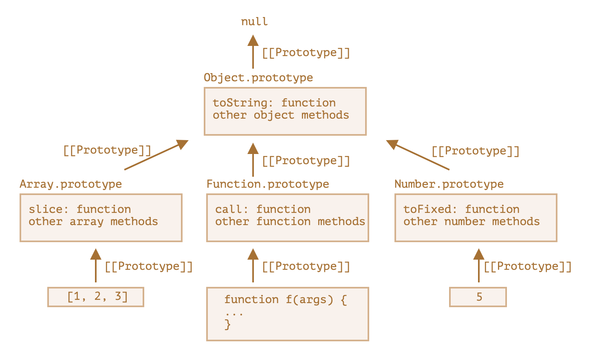

# prototype(프로토타입)

> Java, C++과 같은 클래스 기반 객체지향 프로그래밍 언어와 달리 자바스크립트는 프로토타입 기반 객체지향 프로그래밍 언어이다. 따라서 자바스크립트의 동작 원리를 이해하기 위해서는 프로토타입의 개념을 잘 이해하고 있어야 한다.
>
> 출처: https://poiemaweb.com/js-prototype

Javascript의 모든 객체는 자신의 부모 역할을 담당하는 객체와 연결되어 있다. 이것은 마치 객체 지향의 상속 개념과 같이 부모 객체의 프로퍼티 또는 메소드를 상속받아 사용할 수 있게 한다. 이러한 부모 객체를 Prototype(프로토타입) 객체 또는 줄여서 `Prototype(프로토타입)`이라 한다.

> 프로토타입은 생성자 함수에 의해 생성된 객체에 공유 프로퍼티를 제공하기 위해 사용된다.

## 핵심 질문

<details>
<summary>prototype이란 무엇인가요?</summary>
<br/>

자바스크립트에서 모든 객체는 prototype이라는 내부 링크를 가지고 있습니다. 이는 객체가 어떤 다른 객체를 상속받았는지를 가리키며, 상속을 통해 객체의 프로퍼티와 메소드를 공유할 수 있게 합니다.

</details>

<details>
<summary>prototype chain이란 무엇인가요?</summary>
<br/>

객체가 다른 객체를 상속받은 경우, 이들 객체 간에는 prototype chain이 형성됩니다. 이는 객체에서 특정 프로퍼티나 메소드를 찾을 때, 해당 객체의 prototype을 검색하고 그 다음 상위 객체의 prototype을 검색하는 과정을 의미합니다.

</details>

<details>
<summary>prototype과 __proto__의 차이점은 무엇인가요?</summary>
<br/>

prototype은 객체 생성자 함수의 프로퍼티로서, 해당 생성자 함수로부터 생성된 모든 객체가 상속받을 프로퍼티와 메소드를 정의합니다. **proto**는 모든 객체가 가지고 있는 내부 링크로서, 해당 객체가 상속받은 객체를 가리킵니다.

</details>

<details>
<summary>prototype을 이용한 상속 방법은 무엇이 있나요?</summary>
<br/>

생성자 함수를 사용한 상속, 객체 리터럴을 사용한 상속, Object.create()를 사용한 상속 등이 있습니다.

</details>

<details>
<summary>생성자 함수를 사용한 상속에서 prototype을 어떻게 활용하나요?</summary>
<br/>

생성자 함수의 prototype에 프로퍼티와 메소드를 정의하면, 해당 생성자 함수로부터 생성된 모든 객체가 상속받아 사용할 수 있습니다.

</details>

<details>
<summary>객체 리터럴을 사용한 상속에서 prototype을 어떻게 활용하나요?</summary>
<br/>

객체 리터럴을 사용하여 객체를 생성하면, 해당 객체는 자동으로 Object.prototype 객체를 상속받습니다. 따라서 Object.prototype에 정의된 프로퍼티와 메소드를 사용할 수 있습니다.

</details>

<details>
<summary>Object.create()를 사용한 상속에서 prototype을 어떻게 활용하나요?</summary>
<br/>

Object.create() 메소드를 사용하여 새로운 객체를 생성할 때, 이 객체의 prototype을 직접 지정할 수 있습니다. 이를 통해 원하는 객체를 상속받도록 할 수 있습니다.

</details>

<details>
<summary>prototype 객체에 메소드를 추가하는 방법은 무엇인가요?</summary>
<br/>

생성자 함수의 prototype 객체에 직접 메소드를 추가할 수 있습니다.

</details>

<details>
<summary>prototype 객체에 프로퍼티를 추가하는 방법은 무엇인가요?</summary>
<br/>

생성자 함수의 prototype 객체에 프로퍼티를 추가할 수 있습니다. 하지만, 이 경우 해당 프로퍼티는 모든 객체에서 공유되기 때문에 주의가 필요합니다.

</details>

## 용어정리 및 개념 요약

> [[Prototype]]이 참조하는 객체를 '프로토타입’이라고 한다.
> 객체에서 프로퍼티를 읽거나 메서드를 호출하려는데 해당하는 프로퍼티나 메서드가 없으면 자바스크립트는 프로토타입에서 프로퍼티나 메서드를 찾는다.

### [[Prototype]]

- 함수를 포함한 모든 객체가 가지고 있는 `인터널 슬롯`이다.
- 객체의 입장에서 자신의 부모 역할을 하는 `프로토타입 객체`를 가리키며 함수 객체의 경우 `Function.prototype`를 가리킨다
- 자바스크립트의 모든 객체는 자신의 부모 역할을 담당하는 객체와 연결되어 있다. 그리고 이것은 마치 객체 지향의 상속 개념과 같이 부모 객체의 프로퍼티 또는 메소드를 상속받아 사용할 수 있게 한다. 이러한 부모 객체를 Prototype(프로토타입) 객체 또는 줄여서 Prototype(프로토타입)이라 한다.

Prototype 객체는 생성자 함수에 의해 생성된 각각의 객체에 공유 프로퍼티를 제공하기 위해 사용한다.

### prototype 프로퍼티

- `함수 객체`만 가지고 있는 프로퍼티이다.
- `생성자 함수`가 사용가능하고, `프로토타입의 참조`를 값으로 갖는다.
- 생성자 함수가 자신이 생성할 인스턴스의 프로토타입을 할당하기 위해 사용
- 함수 객체가 `생성자`로 사용될 때 이 함수를 통해 생성될 객체의 부모 역할을 하는 객체(`프로토타입 객체`)를 가리킨다.
- 생성자 함수를 new를 사용해 호출할 때만 적용
- 일반 객체엔 "prototype" 프로퍼티를 추가해도 아무런 일이 일어나지 않는다.

### \_\_proto\_\_ 프로퍼티

- `모든 객체`가 가지고 있는 프로퍼티
- `모든 객체`가 사용가능하고, `프로토타입의 참조`를 값으로 갖는다.
- 객체가 프로토타입에 접근 또는 교체하기 위해 사용한다
- [[Prototype]]용 getter·setter (`접근자`)
- 하위 호환성 때문에 여전히 \_\_proto\_\_를 사용할 순 있지만 비교적 근래에 작성된 스크립트에선 \_\_proto\_\_ 대신 함수 `Object.getPrototypeOf`나 `Object.setPrototypeOf`을 써서 프로토타입을 획득(get)하거나 설정(set) 한다.

### constructor 프로퍼티

- 모든 프로토타입은 constructor 프로퍼티를 갖는다.
- 객체의 입장에서 `자신을 생성한 객체`를 가리킨다.

## [[Prototype]]과 \_\_proto\_\_

모든 객체는 [[Prototype]]이라는 내부 슬롯을 가지며, 이 내부 슬롯(숨김 프로퍼티) 값은 `다른 객체에 대한 참조` 또는 `null`이다. 다른 객체를 참조하는 경우 참조 대상을 `프로토타입`이라고 부른다.

객체가 생성될 때 객체 생성 방식에 따라 프로토타입이 결정되고 [[Prototype]]에 저장된다.

또한 모든 객체는 `\_\_proto\_\_` 접근자 프로퍼티를 통해 자신의 프로토타입, 즉 `[[Prototype]]` 내부 슬롯에 간접적으로 접근할 수 있다.

```js
const dori = { name: 'dori' };
console.log(dori.__proto__);
// {constructor: ƒ, __defineGetter__: ƒ, __defineSetter__: ƒ, hasOwnProperty: ƒ, __lookupGetter__: ƒ, …}
// constructor: ƒ Object()
// hasOwnProperty: ƒ hasOwnProperty()
// isPrototypeOf: ƒ isPrototypeOf()
// propertyIsEnumerable: ƒ propertyIsEnumerable()
// toLocaleString: ƒ toLocaleString()
// toString: ƒ toString()
// valueOf: ƒ valueOf()
// __defineGetter__: ƒ __defineGetter__()
// __defineSetter__: ƒ __defineSetter__()
// __lookupGetter__: ƒ __lookupGetter__()
// __lookupSetter__: ƒ __lookupSetter__()
// __proto__: (...)
// get __proto__: ƒ __proto__()
// set __proto__: ƒ __proto__()

let animal = {
  eats: true,
};
let rabbit = {
  jumps: true,
};

rabbit.__proto__ = animal; // (*)

// 프로퍼티 eats과 jumps를 rabbit에서도 사용할 수 있게 되었습니다.
alert(rabbit.eats); // true (**)
alert(rabbit.jumps); // true

// (*)로 표시한 줄에선 animal이 rabbit의 프로토타입이 되도록 설정하였습니다.
// (**)로 표시한 줄에서 alert 함수가 rabbit.eats 프로퍼티를 읽으려 했는데, rabbit엔 eats라는 프로퍼티가 없습니다. 이때 자바스크립트는 [[Prototype]]이 참조하고 있는 객체인 animal에서 eats를 얻어냅니다.
```

### ❗️ \_\_proto\_\_ 접근자 프로퍼티를 코드 내에서 직접 사용하는 것은 권장하지 않는다.

모든 객체가 _\_proto\_\_ 접근자 프로퍼티를 사용할 수 있는 것은 아니기 때문이다. 직접 상속을 통해 다음과 같이 Object.prototype을 상속받지 않는 객체를 생성할 수도 있기 때문에 _\_proto\_\_ 접근자 프로퍼티를 사용할 수 없을 수도 있다.

따라서, 프로토타입의 참조를 취득하고 싶은 경우 Object.getPrototypeOf 메서드를 사용하고, 프로토타입을 교체하고 싶을 때는 Object.setProtypeOf 매서드를 사용할 것을 권장한다.

```js
const parent = { x: 1 };
// obj는 프로토타입 체인의 종점이어서 Object.__proto__ 를 상속받을 수 없다.
const obj = Object.create(null); // const obj = {}와 같음
console.log(obj.__proto__); // undefined
console.log(Object.getPrototypeOf(obj)); // null
Object.setPrototypeOf(obj, parent); // obj.__proto__ = parent;
console.log(obj.x); // 1
```

## 📌 프로토타입 체인

모든 객체는 프로토타입의 계층 구조인 프로토타입 체인으로 묶여 있다. js엔진은 객체의 프로퍼티에 접근하려고 할 때 해당 객체에 접근하려는 프로퍼티가 없다면 \_\_proto\_\_ 접근자 프로퍼티가 가리키는 `참조를 따라 자신의 부모 역할을 하는 프로퍼티를 순차적으로 검색`한다.

person 객체는 hasOwnProperty 메소드를 가지고 있지 않으므로 에러가 발생해야할 것 같지만 정상적으로 동작한다!

person 객체의 [[Prototype]]이 가리키는 링크를 따라가서 person 객체의 부모 역할을 하는 프로토타입 객체(Object.prototype)의 메소드 hasOwnProperty를 호출하였기 때문에 가능한 것!!

```js
const person = {
  name: '도리',
  skill: 'javascript',
};

// Object.prototype.hasOwnProperty()
console.log(student.hasOwnProperty('name')); // true
console.log(student.__proto__ === Object.prototype); // true
```

## 내장 객체의 프로토타입

> Array, Date, Function을 비롯한 내장 객체들 역시 프로토타입에 메서드를 저장해 놓는다.

배열 [1, 2, 3]을 만들면 new Array()의 디폴트 생성자가 내부에서 동작하여 Array.prototype이 배열 [1, 2, 3]의 프로토타입이 되고 개발자는 Array.prototype을 통해 배열 메서드를 사용할 수 있다. 이런 내부 동작은 메모리 효율을 높여주는 장점을 가져다 준다..

명세서에선 모든 내장 프로토타입의 상속 트리 꼭대기엔 Object.prototype이 있어야 한다고 규정한다. -> "모든 것은 객체를 상속받는다."



> 사진 출처: https://ko.javascript.info/native-prototypes

## 객체 리터럴 방식으로 생성된 객체의 프로토타입 체인

> 객체 생성방법: 객체 리터럴, 생성자 함수, Object()생성자 함수

`객체 리터럴 방식`으로 생성된 객체는 결국 내장 함수(Built-in)인 Object() 생성자 함수로 객체를 생성하는 것을 단순화시킨 것.

Object() 생성자 함수는 함수이기 때문에 함수 객체인 Object() 생성자 함수는 일반 객체와 달리 prototype 프로퍼티가 있다.

## 생성자 함수에 의해 생성된 객체의 프로토타입

> 함수 정의하는 방식: 함수 선언식, 함수 표현식, Function() 생성자 함수

결국 `함수선언식`, `함수표현식` 모두 함수 리터럴 방식을 사용한다. 함수 리터럴 방식은 Function() 생성자 함수로 함수를 생성하는 것을 단순화 시킨 것. 즉, `3가지 함수 정의 방식`은 결국 `Function() 생성자 함수를 통해 함수 객체를 생성`한다, 따라서 어떠한 방식으로 함수 객체를 생성하여도 모든 함수 객체의 prototype 객체는 Function.prototype이다.

```js
function Person(name) {
  this.name = name;
  this.getName = function () {
    return this.name;
  };
}

const 도리 = new Person('dori');
const 크롱 = new Person('크롱');

console.log(도리.getName === 크롱.getName); // false

function Person_proto(name) {
  this.name = name;
}

// 프로토타입 Person_proto로부터 getName이라는 메서드를 상속 받는다.
// Person_proto 생성자 함수로 생성한 모든 인스턴스는 하나의 getName메서드를 공유한다.
Person_proto.prototype.getName = function () {
  return this.name;
};

const 도리 = new Person_proto('dori');
const 크롱 = new Person_proto('크롱');

console.log(도리.getName === 크롱.getName); // true
```

## 상속과 프로토타입

`상속`은 객체지향 프로그래밍의 핵심개념으로, 어떤 객체의 프로퍼티 또는 메서드를 다른 객체가 상속받아 그대로 사용할 수 있는 것을 말한다.

> js는 프로토타입을 기반으로 상속을 구현하여 불필요한 중복을 제거한다.

### prototype을 활용한 상속

```js
function Person(name) {
  this.name = name;
}

Person.prototype.sayHi = function () {
  console.log('hi');
};

function Student(name, grade) {
  Person.call(this, name); // this의 타겟변경
  this.grade = grade;
}
// 1번: sayHi가 없음
const a = new Student('a', 'a');
Student.prototype = Object.create(Person.prototype); //
// 2번: construtor가 Person임, sayHi있음
const aa = new Student('aa', 'aa');
Student.prototype.construtcor = Student;
// 3번: construtor가 Student이고 sayHi있음
const aaa = new Student('aaa', 'aaa');

// 혹은 Object.setPrototypeOf사용
Object.setPrototypeOf(Student.prototype, Person.prototype);
```

## 활용 연습 repo

https://github.com/kimyouknow/soc-template/tree/33167ee11c8bec1eb412c383dc448303b5a6120d

### HTML Core Element

```js
export default function HtmlElement({ $element }) {
  this.$element = $element;
}

HtmlElement.prototype.init = function () {
  this.render();
  this.renderChild();
  this.setEvent();
};

HtmlElement.prototype.connectStore = function () {};

HtmlElement.prototype.setTemplate = function () {
  return ``;
};

HtmlElement.prototype.renderChild = function () {};

HtmlElement.prototype.beforeRender = function () {
  this.state = {};
};

HtmlElement.prototype.render = function () {
  this.beforeRender();
  this.$element.innerHTML = this.setTemplate();
};

HtmlElement.prototype.setEvent = function () {};
```

```js
export function setInheritance({ parent, child }) {
  child.prototype = Object.create(parent.prototype);
  child.prototype.constructor = child;
}
```

### Main Page Element

```js
import ClickCard from '../../components/ClickCard/index.js';
import HtmlElement from '../../core/HtmlElement.js';
import { handleClick } from './eventHandler.js';
import { setInheritance } from '../../utils/manipulateDom.js';
import mainStore from './store.js';

export default function Main({ $element }) {
  HtmlElement.call(this, { $element });
}

setInheritance({ parent: HtmlElement, child: Main });

Main.prototype.beforeRender = function () {
  this.state = {
    ...this.interface.getStateFromStore({
      mockArr: null,
    }),
  };
};

Main.prototype.setTemplate = function () {
  const { mockArr } = this.state;
  return mockArr.length === 0
    ? `<div>Loading....</div>`
    : mockArr
        .map((clickObj) => {
          const $clickCard = new ClickCard({
            $element: this.$element,
            isDirect: true,
            props: clickObj,
          });
          return $clickCard.setTemplate();
        })
        .join('');
};

Main.prototype.setEvent = function () {
  this.$element.addEventListener('click', handleClick.bind(this));
};
```

🔍 참고자료

- 모던자바스크립트 딥 다이브: 19장
- [프로토타입 - poiemaweb](https://poiemaweb.com/js-prototype)
- [프로토타입과 프로토타입 상속 - javascript](https://ko.javascript.info/prototypes)
- [[10분 테코톡] 💼 크리스의 Prototype](https://www.youtube.com/watch?v=RYxgNZW3wl0)
- [Javascript - prototype의 이해 : 넥스트리소프트](https://www.nextree.co.kr/p7323/)
- [Javascript Interview Questions: Javascript is a prototypal language. What do I mean by this?
  ](https://medium.com/edge-coders/javascript-interview-questions-javascript-is-a-prototypal-language-what-do-i-mean-by-this-76937a9aa42a)
- https://javascript.plainenglish.io/prototypes-in-javascript-js-interview-series-e254cc08f75
- https://www.explainthis.io/en/interview-guides/javascript/most-common-js-prototype-questions
