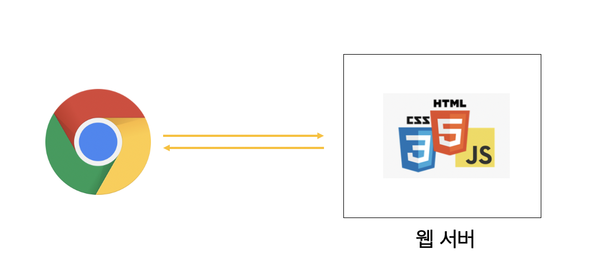
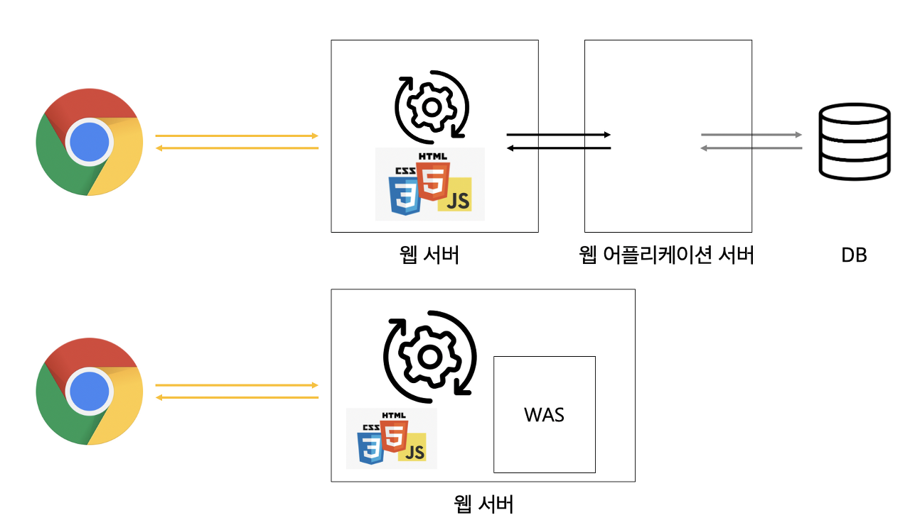
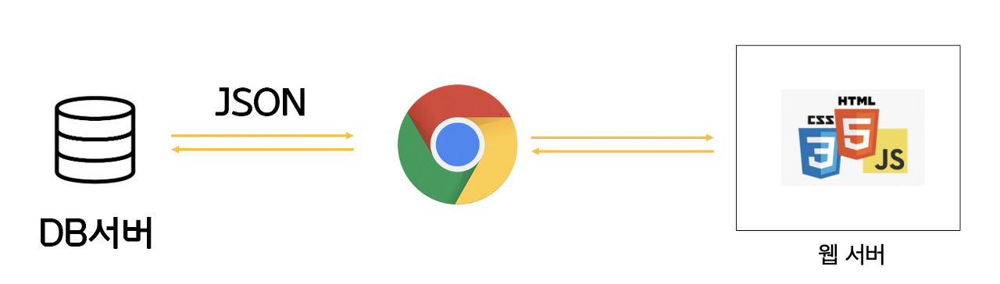

# 목표

- [ ] Static Pages와 Dynamic Pages 과정을 이해
- [ ] Web Server와 WAS의 차이를 이해
- [ ] Web 서비스 구조(Web Service Architecture)에 대해 이해

# 정적사이트(Static Pages)와 동적사이트(Dynamic Pages)


## 정적사이트(Static Pages)

- 웹 서버에 이미 완성본으로 저장되어 있는 파일(html)을 전달하는 웹 페이지
- 한 요청에 관하여 모든 사용자가 같은 결과를 받는다.
- 사용자는 서버의 데이터가 변경되지 않는 한 고정된 웹페이지를 보게 된다.



## 동적사이트(Dynamic Pages)

- 서버에 있는 데이터를 스크립트에 의해 가공처리하여 만들어진 html 문서를 전달하는 웹 페이지
- 요청에 관하여 사용자는 조건에 따라 다른 결과를 받는다.
- 사용자는 상황, 시간, 요청 등에 따라 달라지는 웹 페이지를 보게 된다.



## **클라이언트 사이드 렌더링(CSR)은 정적웹? 동적웹?**

React나 Vue로 웹개발을 했다면 `클라이언트 사이드 렌더링`을 하는데 이것은 정적웹 동적웹 둘 중 어느 방식으로 동작할까?

```
정적웹으로 동작한다. 
```

React나 Vue로 만든 웹앱 서비스는 웹서버에서 단순히 웹껍데기(= 정적자원 : html, css, javascript)를 다운 받고, 클라이언트인 브라우저가 다른 서버(주로 DB를 다루는 서버)와 JSON으로 데이터를 주고받으며(데이터 통신) 여러 가지 작업들을 수행한다.

이때, 클라이언트의 핵심 작업들은 웹서버에서 가져온 javascript 코드가 담당한다.



# Web Server와 WAS의 차이


## Web Client(사용자 에이전트)

사용자를 대신하여 동작하는 모든 도구들. 주로 브라우저에 의해 수행.

브라우저는 항상 요청을 보내는 개체다. 결고 서버가 될 수 없다.

`웹 페이지`: 하이퍼텍스트 문서로, 표시된 텍스트 중 일부는 사용자가 사용자 에이전트를 제어하고 웹을 이동할 수 있도록 하게 하는 링크.

`브라우저`: HTTP 요청 내에서 이런 지시 사항들을 변환하고 HTTP 응답을 해석하여 사용자에게 명확한 응답을 표시

## Web Server 란?

```
WEB 서버는 HTML 문서같은 **정적 컨텐츠**를 처리(HTTP 프로토콜을 통해 읽힐 수 있는 문서)
```

클라이언트에 의한 요청에 대한 문서를 제공하는 서버. 반드시 단일 머신일 필요는 없지만, 여러 개의 서버를 동일한 머신 위에서 호스팅 가능.

한 개 이상의 웹사이트를 호스팅하는 컴퓨터(웹사이트와 웹서버는 다르다. 웹사이트가 반응하지 않는다는 것은 웹 서버가 반응하지 않는다는 의미다. 웹 서버는 여러 웹사이트를 호스팅될 수 있다.)

`웹 브라우저(client)`로부터 `http 요청`을 받아 html 문서와 같은 `정적 컨텐츠`를 제공하는 프로그램

### webserver는 하드웨어, 소프트웨어 혹은 두 개가 같이 동작하는 것을 의미한다.

**하드웨어**

- web server의 소프트웨어와 website의 컴포넌트 파일들(html, css, js)을 저장하는 컴퓨터.
- web server는 인터넷에 연결되어 웹이 연결된 다른 기기들이 웹 서버의 데이터를 주고받을 수 있도록 한다.

**소프트웨어**

- 웹 상자가 어떻게 호스트 파일들에게 접근하는지 관리.
- web server를 http server로 국한했을 때, http server는 url과 http의 소프트웨어 일부.

### web server 기능

**정적 컨텐츠 제공 :** WAS(Web Application Server)를 거치지 않고 정적자원제공

**동적 컨텐츠 제공 :** WAS(Web Application Server)로 전달하여 WAS가 처리한 결과를 client에게 전달.

### 웹 서버 종류

Apache, Nginx, IIS 등

## WAS 란?

```
DB 조회나 다양한 로직 처리를 요구하는 동적인 컨텐츠를 제공하기 위해 만들어진 Application Server
```

- 요청 인자에 따라 `바뀔 수 있는 컨텐츠를 처리`
- 쉽게 설명하자면, 웹 프레임 워크를 사용해 구축하는 백앤드라고 할 수 있다. 주로 데이터베이스와 서버와 같이 관리된다.

### WAS의 역할

- Web server와 Web Container로 구성
- 서버의 기능들을 구조적으로 분리하여 처리하는 역할
- 보안, 스레드 처리, 분산 트랜잭션 등 분산 환경에서 사용됨 ( 주로 DB 서버와 함께 사용 )

### WAS의 기능

- clientf로부터 http 요청 받을 수 있음(대부분의 was는 web server 내장)
- 요청에 맞는 정적 컨텐츠를 제공
- db 조회나 다양한 로직 처리를 통해 동적 컨텐츠 제공

처리하는 기능은 나누어져있지만 요새 WAS 서버에는 웹 서버 기능을 내장하고 있다. 현재는 WAS가 가지고 있는 웹 서버도 정적인 콘텐츠를 처리하는 데 있어서 성능상 큰 차이가 없다.

### 예시

Tomcat, JBoss, Jeus, Web Sphere 등

# 웹서버와 WAS를 구분하는 이유

## 웹서버가 필요한 이유

웹 서버에서는 정적 컨텐츠만 처리하도록 기능 분배를 해서 서버 부담을 줄일 수 있다.

```
클라이언트가 이미지 파일(정적 컨텐츠)를 보낼 때를 생각해보자.

웹 문서(html 문서)가 클라이언트로 보내질 때 이미지 파일과 같은 정적 파일은 함께 보내지지 않는다.

1) html 문서를 받고
2) 이에 필요한 이미지 파일들을 다시 서버로 요청

따라서 웹 서버를 통해서 정적인 파일을 애플리케이션 서버까지 가지 않고 앞단에 빠르게 보낼 수 있다.
```

## WAS가 필요한 이유

WAS를 통해 요청에 맞는 데이터를 DB에서 가져와 비즈니스 로직에 맞게 그때마다 결과를 만들고 제공하면서 자원을 효율적으로 사용할 수 있다.

```
웹페이지에서는 정적 콘텐츠와 동적 콘첸트가 모두 존재한다.

이 때, 웹 서버만으로는 사용자가 원하는 요청에 대한 결과값을 모두 미리 만들어놓고 서비스하기에는 자원이 절대적으로 부족하다.

따라서 WAS를 통해 요청이 들어올 때마다 DB와 비즈니스 로직을 통해 결과물을 만들어 제공한다.
```

## **WAS로 웹 서버 역할까지 다 처리하지 않는 이유**

```
자원 이용의 효율성 및 장애 극복, 배포 및 유지보수의 편의성을 위해 웹 서버와 WAS를 분리한다.
```

### 기능을 분리하여 서버 부하 방지

- WAS는 DB 조회, 다양한 로직을 처리하는 데 바쁘기 때문에 정적 컨텐츠는 웹 서버에게 맡겨 빠르게 클라이언트에게 제공하기.
- 약 WAS가 정적 컨텐츠 요청까지 처리하면, 부하가 커지고 동적 컨텐츠 처리가 지연되면서 수행 속도가 느려질 수 있다.
- 이로 인해 페이지 노출 시간 늘어나는 문제 발생할 수 있다.

### 물리적으로 분리하여 보안 강화

- SSL에 대한 암복호화 처리에 Web Server를 사용

### 여러 대의 WAS를 연결 가능

- Load Balancing을 위해서 웹 서버를 사용
- fail over(장애 극복), fail back 처리에 유리
- 특히 대용량 웹 어플리케이션의 경우(여러 개의 서버 사용) 웹서버와 WAS를 분리하여 무중단 운영을 위한 장애 극복에 쉽게 대응할 수 있다.
- 예를 들어, 웹 서버를 앞 단에 두고, WAS에 오류가 발생하면 사용자가 이용하지 못하게 막아둔 뒤 재시작하여 해결할 수 있음 (사용자는 오류를 느끼지 못하고 이용 가능)

# 효율적인 방법

웹 서버를 WAS 앞에 두고, 필요한 WAS들을 웹 서버에 플러그인 형태로 설정하면 효율적인 분산 처리하는 3번이 적절하다고 한다.

```
1) Client -> Web Server -> DB
2) Client -> WAS -> DB
3) Client -> Web Server -> WAS -> DB
```


🔍 참고자료

- [Web Server & WAS](https://www.howdy-mj.me/network/web-server-and-was/)
- [What is a web server?](https://developer.mozilla.org/en-US/docs/Learn/Common_questions/What_is_a_web_server)
- [Client-Server Overview](https://developer.mozilla.org/en-US/docs/Learn/Server-side/First_steps/Client-Server_overview)
- [MDN - 웹의 동작 방식](https://developer.mozilla.org/ko/docs/Learn/Getting_started_with_the_web/How_the_Web_works)
- [MDN - 인터넷은 어떻게 동작하는가?](https://developer.mozilla.org/ko/docs/Learn/Common_questions/How_does_the_Internet_work)
- [https://maily.so/grabnews/posts/ce76c9](https://maily.so/grabnews/posts/ce76c9)
