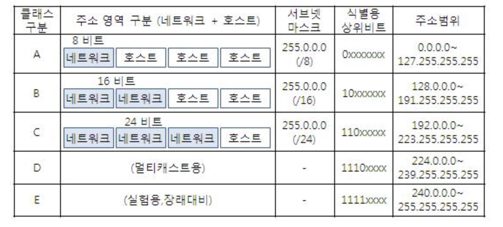
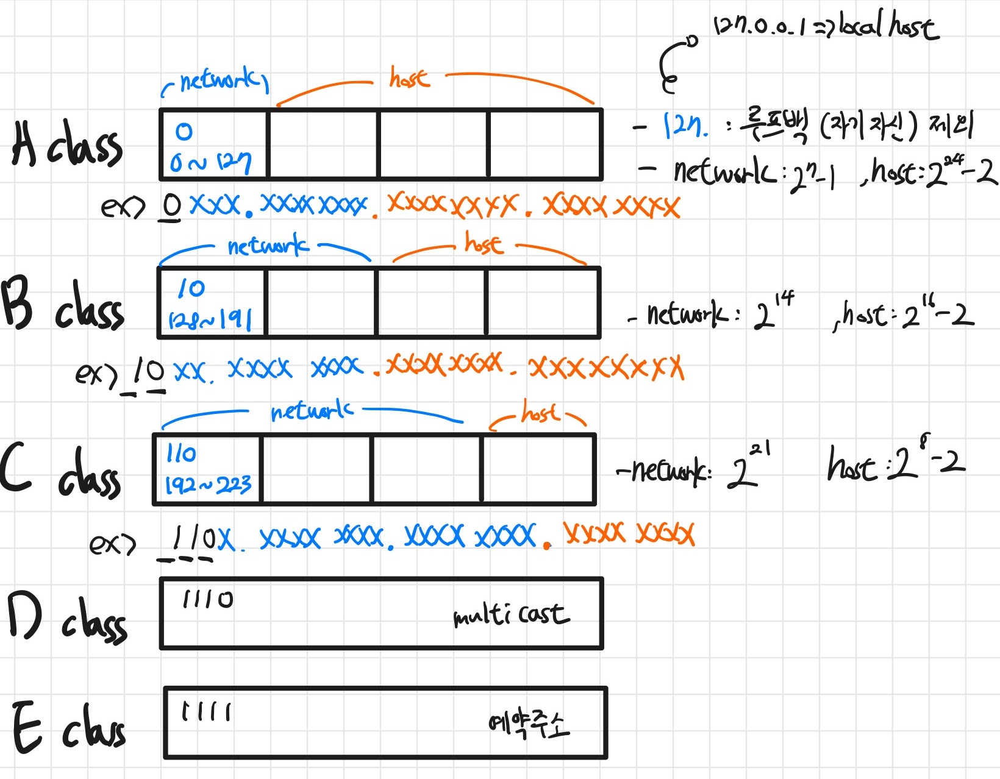
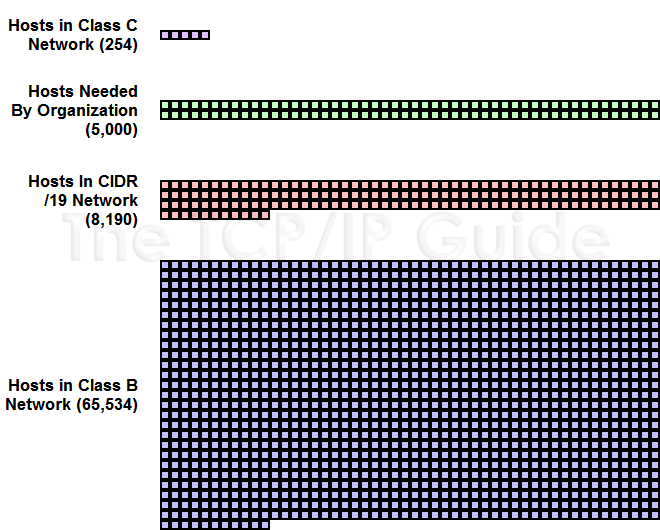

# IP주소 체계

## IPv4 vs IPv6

- IPv4 주소체계
  - IPv4 체계의 IP 주소로는 0.0.0.0부터 255.255.255.255까지 2의 32제곱, 약 42억 개의 주소를 사용할 수 있다
  - 3자리 숫자가 4마디로 표기(각 마디를 옥텟(octet)이라 한다).
  - 컴퓨터 내부적으로는 이를 32개의 이진수(32비트)로 처리하기 때문이다.
- IPv6 주소체계
  - 한 사람당 소유한 기기 개수의 증가로 부족해진 IP주소로 인해 등장
  - 주소 길이를 128비트로 늘려 사용가능한 주소의 갯수가 2의 128제곱개 정도
  - 보통 두 자리 16진수 여덟 개를 쓰고 각각을 : 기호로 구분한다.

IPv4 vs IPv6 중요한 차이

- IPv4는 체크섬이 있지만 IPv6는 체크섬이 없다.
  - IPv6는 헤더를 효율적으로 쓰기 위해 CRC(순환중복검사)를 제외한다.
  - IP계층의 상위계층인 전송계층에서 TCP,UDP가 이미 체크섬을 처리한다.
    - UDP에는 체크섬이 선택사항이라서 IPv6와 UDP를 사용하는 경우에는 체크섬을 사용해야한다.
- IPv4는 헤더가 가변길이지만, IPv6는 고정길이(40byte)라서 인터넷 헤더 길이에 대한 정보, 식별, 플래그 등이 삭제되었다.
- 보통 IPv6가 속도가 빠르지만 IPv6이 사용하는 더 큰 패킷 크기로 인해 일부 사용 사례에서는 속도가 느려질 수 있다.
- IPv6는 IPv4보다 주소커버리지가 높다.
- IPv6는 IPv4보다 헤더가 단순해져서 빠르게 데이터 처리가 가능하다.
- IPv6는 IPv4보다 IPSec(데이터 패킷을 암호화 하는 보완 네트워크 프로토콜 제품군)이 내장되어 있어서 패킷 자체가 암호되어 있다.

## IP주소의 클래스

IP인터넷 주소는 `인터네 주소`로, `네트워크 주소`와 `호스트 주소` 두 부분으로 나뉜다.

- 네트워크 주소: 호스트들을 모은 네트워크, 네트워크 주소가 동일하다면 로컬네트워크다.
- 호스트 주소: 호스트(컴퓨터 네트워크에 연결된 컴퓨너나 기타 장치)를 구분하기 위한 주소
- 하나의 네트워크안에 IP들은 네트워크 영역은 같아야 하고 호스트 IP는 서로 달라야 통신이 가능하다.

- `클래스`는 하나의 IP주소에서 네트워크 영역과 호스트 영역을 나누는 방법

> IPv4를 기준으로 설명 예시 (https://limkydev.tistory.com/168)

- 203.240.100.1 에서 203.240.100 은 네트워크 영역이고 1 은 호스트 IP라는 사실을 알 수 있다.
- 여기서 어떻게 네트워크 주소와 호스트 주소를 구분할 수 있을까? 바로 클래스 때문이다.
- 203.240.100.1 IP가 C클래스이기 때문에 203.240.100 은 네트워크 주소이고, 1은 호스트 주소란 사실을 알아낼 수 있다.
- 이렇게 IP주소에는 클래스라는 개념이 있고 이 클래스의 개념을 알아야 어디까지가 네트워크 영역이고 호스트IP 영역인지 알 수 있습니다.

## 클래스풀(Classfull IP Addressing)

> 출처: http://www.ktword.co.kr/test/view/view.php?m_temp1=2461

### A클래스

- 네트워크 주소 범위: 1 ~ 126으로 시작
- 한 네트워크당 2 ^ 24 - 2 호스트 ID
- 127은 루프백이기 때문에 제외(127.0.0.1 == localhost)
- 0.0.0.0도 특수주소로 포함되어서 제외 (알 수 없는 대상에 달아 놓는 임시주소)

### B클래스

- 네트워크 주소 범위: 128 ~ 191으로 시작
- 한 네트워크당 2 ^ 16 - 2 호스트 ID

### C클래스

- 네트워크 주소 범위: 129 ~ 223으로 시작
- 한 네트워크당 2 ^ 8 - 2 호스트 ID

### 호스트ID 개수에서 2를 빼는 이유

맨 앞자리는 `네트워크 주소`로 남겨두며 마지막 주소는 `브로드캐스팅 주소`로 남겨둠

### 요약

### 클래스 풀의 장점과 단점

장점

- 네트워크 주소와 호스트 주소를 구분짓는 구분자(서브넷 마스크)가 필요없다.
- 맨 앞자리 숫자만 보면 자연스럽게 이 주소가 어느 클래스에 속해 있는지 구분할 수 있기 때문

단점

- 네트워크의 크기가 작은 경우 큰 네트워크르 필요로 하는 조직은 여러 개를 확보해야하는 어려움이 있다.
- 작은 네트워크가 필요한 조직의 경우 너무 많은 IP를 가져가므로 IP가 낭비된다.
- 인터넷이 보편화되어 호스트 수가 증가함에 따라, 클래스풀 체계만으로는 모든 IP 주소의 요구를 감당할 수 없게 됨

> 출처 : http://www.tcpipguide.com/free/t_IPClasslessAddressingandSupernettingOverviewMotiva-3.htm

### 참고자료

- https://limkydev.tistory.com/168
- https://haeunyah.tistory.com/89
