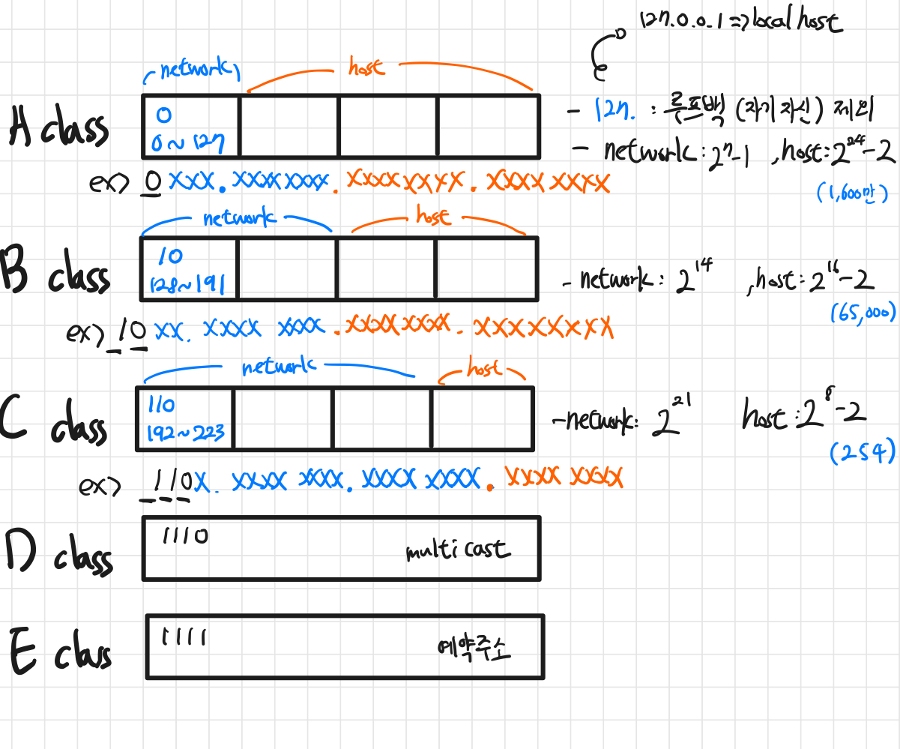

# IP주소 체계

기존에 사용하던 클래스 풀 기반 주소 체계는 이론적으로 43억 개의 IP개수를 가지고 있지만 실제로 사용할 수 있는 IP 개수는 적다. IP 주소 부족과 낭비 문제를 해결하기 위해 3가지 보존, 전환 전략이 만들어졌다.

- 단기 대책: 클래스리스, CIDR
- 중기 대첵: NAT와 사설 IP 주소
- 장기 대첵: IPv6

## 공인 IP / 사설 IP / 고정 IP / 유동 IP

### 고정 IP

- 컴퓨터에 고정적으로 부여된 IP
- 한번 부여되면 IP 반납을 하기 전까지는 다른 장비에 부여할 수 없는 고유의 IP
- 보안성이 우수하기 때문에 보안이 필요한 업체나 기관에서 사용

### 유동 IP

- 인터넷 사용자 모두에게 고정 IP를 부여해 주기는 힘들기 때문에, 일정한 주기 또는 사용자들이 인터넷에 접속하는 매 순간마다 사용하고 있지 않은 IP 주소를 임시로 발급해 주는 IP이다.
- 대부분의 사용자는 유동 IP를 사용한다.

### 공인 IP

- IP 주소는 임의로 우리가 부여하는 것이 아니라 전 세계적으로 ICANN이라는 기관이 국가별로 사용할 IP 대역을 관리하고, 우리나라는 한국인터넷진흥원(KISA)에서 국내 IP 주소들을 관리하고 있다.
- 이것을 ISP(Internet Service Provider의 약자로 KT, LG, SKT와 같이 인터넷을 제공하는 통신업체)가 부여받고, 우리는 위 회사에 가입을 통해 IP를 제공받아 인터넷을 사용하게 되는 것이다.
- 이렇게 발급받은 IP를 공인 IP라고 한다.

### 사설 IP

- 사설 IP는 어떤 네트워크 안에서만 내부적으로 사용되는 고유한 주소이다. 로컬 IP라고 부른다.
- 공유기를 사용한 인터넷 접속 환경일 경우 공유기까지는 공인 IP 할당을 하지만, 공유기에 연결되어 있는 가정이나 회사의 각 네트워크 기기에는 사설 IP를 할당한다.
- 공인 IP는 전 세계에서 유일하지만, 사설 IP는 하나의 네트워크 안에서 유일하다.
- 공인 IP는 외부, 내부 상관없이 해당 IP에 접속할 수 있으나, 사설 IP는 내부에서만 접근이 가능하다.

## NAT

- https://inpa.tistory.com/entry/WEB-🌐-NAT-란-무엇인가

## IPv4 vs IPv6

- IPv4 주소체계
  - IPv4 체계의 IP 주소로는 0.0.0.0부터 255.255.255.255까지 2의 32제곱, 약 42억 개의 주소를 사용할 수 있다
  - 3자리 숫자가 4마디로 표기(각 마디를 옥텟(octet)이라 한다).
  - 컴퓨터 내부적으로는 이를 32개의 이진수(32비트)로 처리하기 때문이다.
- IPv6 주소체계
  - 한 사람당 소유한 기기 개수의 증가로 부족해진 IP주소로 인해 등장
  - 주소 길이를 128비트로 늘려 사용가능한 주소의 갯수가 2의 128제곱개 정도
  - 보통 두 자리 16진수 여덟 개를 쓰고 각각을 : 기호로 구분한다.

IPv4 vs IPv6 중요한 차이

- IPv4는 체크섬이 있지만 IPv6는 체크섬이 없다.
  - IPv6는 헤더를 효율적으로 쓰기 위해 CRC(순환중복검사)를 제외한다.
  - IP계층의 상위계층인 전송계층에서 TCP,UDP가 이미 체크섬을 처리한다.
    - UDP에는 체크섬이 선택사항이라서 IPv6와 UDP를 사용하는 경우에는 체크섬을 사용해야한다.
- IPv4는 헤더가 가변길이지만, IPv6는 고정길이(40byte)라서 인터넷 헤더 길이에 대한 정보, 식별, 플래그 등이 삭제되었다.
- 보통 IPv6가 속도가 빠르지만 IPv6이 사용하는 더 큰 패킷 크기로 인해 일부 사용 사례에서는 속도가 느려질 수 있다.
- IPv6는 IPv4보다 주소커버리지가 높다.
- IPv6는 IPv4보다 헤더가 단순해져서 빠르게 데이터 처리가 가능하다.
- IPv6는 IPv4보다 IPSec(데이터 패킷을 암호화 하는 보완 네트워크 프로토콜 제품군)이 내장되어 있어서 패킷 자체가 암호되어 있다.

## IP주소의 클래스

IP인터넷 주소는 `인터네 주소`로, `네트워크 주소`와 `호스트 주소` 두 부분으로 나뉜다.

- 네트워크 주소: 호스트들을 모은 네트워크, 네트워크 주소가 동일하다면 로컬네트워크다.
- 호스트 주소: 호스트(컴퓨터 네트워크에 연결된 컴퓨너나 기타 장치)를 구분하기 위한 주소
- 하나의 네트워크안에 IP들은 네트워크 영역은 같아야 하고 호스트 IP는 서로 달라야 통신이 가능하다.

- `클래스`는 하나의 IP주소에서 네트워크 영역과 호스트 영역을 나누는 방법

  - > IPv4를 기준으로 설명 예시 (https://limkydev.tistory.com/168)
  - 203.240.100.1 에서 203.240.100 은 네트워크 영역이고 1 은 호스트 IP라는 사실을 알 수 있다.
  - 여기서 어떻게 네트워크 주소와 호스트 주소를 구분할 수 있을까? 바로 클래스 때문이다.
  - 203.240.100.1 IP가 C클래스이기 때문에 203.240.100 은 네트워크 주소이고, 1은 호스트 주소란 사실을 알아낼 수 있다.
  - 이렇게 IP주소에는 클래스라는 개념이 있고 이 클래스의 개념을 알아야 어디까지가 네트워크 영역이고 호스트IP 영역인지 알 수 있다.

## 클래스풀(Classfull IP Addressing)

> 출처: http://www.ktword.co.kr/test/view/view.php?m_temp1=2461

### A클래스

- 네트워크 주소 범위: 1 ~ 126으로 시작
- 한 네트워크당 2 ^ 24 - 2(약 1,600만 개) 호스트 ID 할당 가능
- 127은 루프백이기 때문에 제외(127.0.0.1 == localhost)
- 0.0.0.0도 특수주소로 포함되어서 제외 (알 수 없는 대상에 달아 놓는 임시주소)

### B클래스

- 네트워크 주소 범위: 128 ~ 191으로 시작
- 한 네트워크당 2 ^ 16 - 2(65,000개) 호스트 ID 할당 가능

### C클래스

- 네트워크 주소 범위: 129 ~ 223으로 시작
- 한 네트워크당 2 ^ 8 - 2(254개) 호스트 ID 할당 가능

### 호스트ID 개수에서 2를 빼는 이유

맨 앞자리는 `네트워크 주소`로 남겨두며 마지막 주소는 `브로드캐스팅 주소`로 남겨둠

### 요약

### 클래스 풀의 장점과 단점

장점

- 네트워크 주소와 호스트 주소를 구분짓는 구분자(서브넷 마스크)가 필요없다.
- 맨 앞자리 숫자만 보면 자연스럽게 이 주소가 어느 클래스에 속해 있는지 구분할 수 있기 때문

단점

- 네트워크의 크기가 작은 경우 큰 네트워크르 필요로 하는 조직은 여러 개를 확보해야하는 어려움이 있다. (ex: 5,000개의 호스트가 필요할 때, C클래스-254개를 쓰면 부족)
- 작은 네트워크가 필요한 조직의 경우 너무 많은 IP를 가져가므로 IP가 낭비된다. (ex: 5,000개의 호스트가 필요할 때, B클래스-65,000개를 쓰면 낭비)
- 인터넷이 보편화되어 호스트 수가 증가함에 따라, 클래스풀 체계만으로는 모든 IP 주소의 요구를 감당할 수 없게 됨

> 출처 : http://www.tcpipguide.com/free/t_IPClasslessAddressingandSupernettingOverviewMotiva-3.htm

## 클래스리스(Classless IP Addressing)

- CIDR(Classless Inter-Domain Routing): 클래스가 존재하지 않는 도메인간 라우팅 기법.
- `세분화`: 기존의 클래스풀 방식의 경우 선택지가 한정적이기에 낭비되는 주소 체계가 생겼지만, CIDR의 경우 네트워크 부분과 호스트 부분을 1비트 단위까지 구분이 가능하여 호스트 주소를 보다 더 유연하게 할당할 수 있다.
- 현재 우리가 사용하고 있는 주소체계는 클래스 개념을 적용하지 않는 클래스리스 기반 주소체계

### 핵심 개념

- `서브네팅`:

  - 네트워크를 나눈다는 의미,
  - 자원을 효율적으로 분배하기 위해 네트워크 영역과 호스트 영역을 쪼개는 작업
  - IP주소를 효울적으로 나누어 사용하기 위한 방법으로 네트워크 성능 보장
  - 서브넷팅을 하면 IP 할당 범위를 더 작은 단위로 나눌 수 있게 된다.

- `서브넷`: 서브네트워크, 쪼개진 네트워크
- `서브넷 마스크`: 서비네트워크를 위한 비트마스크

### 서브넷 마스크로 네트워크 주소 및 호스트 주소 찾기

| IPv4 주소             | 102.168.50.112                      |
| --------------------- | ----------------------------------- |
| 서브넷 마스크         | 255.255.255.0                       |
| IPv4 주소(binary)     | 11000000.10101000.00110010.01110000 |
| 서브넷 마스크(binary) | 11111111.11111111.11111111.00000000 |
| And 연산              | TTFFFFFF.TFTFTFFF.FFTTFFTF.FFFFFFFF |
| 네트워크 주소         | 11000000.10101000.00110010.00000000 |

- 서브넷 마스크
  - 1이 연속한 부분: 네트워크 주소
  - 나머지 0이 있는 자리: 호스트 주소
  - 클래스 풀의 A,B,C클래스는 다음과 같은 서브넷 마스크로 표기 가능
    - A: 255.0.0.0
    - B: 255.255.0.0
    - C: 255.255.255.0
- And 연산을 활용해 네트워크 주소와 호스트 주소를 구분

### CIDR 표기법

- 연속된 1의 개수로 네트워크 부분을 파악 가능
  - 위의 예시에서 102.168.50.112/24 -> 24 = 연속된 1의 개수

### 활용 예시

- T기업: 호스트(전자기기) 50개 사용
- 현재 사용하는 IP 주소: 192.168.10.0/24 => C클래스, 총 256개의 주소를 할당
- 50개 밖에 사용하지 않는데 256개를 전부 할당하면 낭비이므로 `서브넷 구분 비트를 활용해 세분화`하기
- 192.168.10.0/25 -> 128개 -> 반으로 더 나눠도 50개 호스트 할당 가능
- 192.168.10.0/26 -> 64개 => 해당 네트워크의 서브넷 마스크는 255.255.255.192로 하면 적당하다고 할 수 있다.
- 맨 앞은 네트워크 주소, 맨 뒤의 브로드 캐스트를 제외한 62개를 호스트로 할당 가능하다.

256개 전체를 주기에는 낭비가 되니까, 이 256개를 절반으로 나누고(128개) 또 절반으로 나눈(64개) 주소를 기업에게 할당하고 남는 네트워크 주소는 다른 사용처로 할당하는 효율적인 작업이 바로 서브네팅 원리이다.

### 참고자료

- IT 엔지니어를 위한 네트워크 입문 - 고재성,이상훈
- https://limkydev.tistory.com/168
- https://haeunyah.tistory.com/89
- https://zzang9ha.tistory.com/413
- https://inpa.tistory.com/entry/WEB-IP-클래스-서브넷-마스크-서브넷팅-총정리
- https://nordvpn.com/ko/blog/public-ip-and-private-ip/
