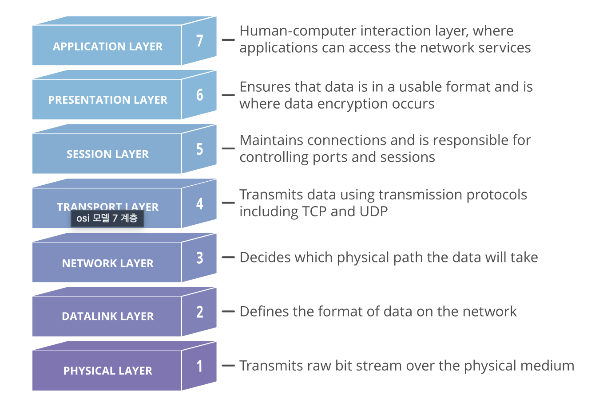

# OSI 7계층

## OSI 모델이란?

- OSI란 표준 프로토콜을 사용하여 다양한 통신 시스템이 통신할 수 있도록 하는 개념 모델이다.
  - `프로토콜`: 네트워킹에서 데이터 형식 지정 및 처리를 위한 규칙 집합이다. 네트워크 내의 서로 다른 소프트웨어와 하드웨어를 가진 컴퓨터끼리 통신할 수 있게 하는 공통 언어와 같다.
- OSI는 상이한 컴퓨터 시스템이 서로 통신할 수 있도록 표준을 제공합니다.
- 통신 시스템을 7개의 추상적 계층으로 나누며 각 계층은 다음 계층 위에 쌓인다.
- 현대 인터넷이 OSI모델을 엄격하게 따르지 않지만 OSI 모델의 장점이 있기 때문에 계층을 나눈다.
  - `표준과 학습 도구`: 표준화를 통해 이질적인 포트 문제나 프로토콜 등으로 인한 문제를 해결하여 비용을 절감
  - `계층화`: 계층별의 기능과 통신 과정을 단계별로 나누어서 쉽게 알 수 있고, 특정한 곳에 이상이 생기면 그 단계만 수정할 수 있기 때문에 편리하다.

> 출처: https://www.cloudflare.com/ko-kr/learning/ddos/glossary/open-systems-interconnection-model-osi/

## OSI 7계층 설명

### [7] 응용 계층 (Application Layer)

- 사용자의 데이터와 직접 상호 작용하는 계층
- 통신의 최종 목적지
- 많은 프로토콜이 존재하는 계층으로, 새로운 프로토콜 추가도 굉장히 쉽다.
- 데이터 단위: message
- 프로토콜: HTTP, SMTP, FTP, SIP 등

### [6] 표현 계층 (Presentation Layer)

- 데이터를 준비하는 역할, 애플리케이션 계층이 이를 사용할 수 있게 한다.
- 데이터의 암호화, 복호화와 같이 응용 계층에서 교환되는 데이터의 의미를 해석하는 계층
- 응용 프로그램 < = > 네트워크 간 정해진 형식대로 데이터를 변환
- 애플리케이션 계층에서 수신한 데이터를 계층 5로 전송하기 전에 압축. 전송할 데이터의 양을 최소화함으로써 통신의 속도와 효율을 높힌다.
- 데이터 단위 message
- 프로토콜 ASCII, MPEG 등

### [5] 세션 계층 (Session Layer)

- 세션: 통신이 시작될 때부터 종료될 때까지의 시간
- 두 기기 사이의 통신을 시작하고 종료하는 일을 담당하는 계층
  - 교환되고 있는 모든 데이터를 전송할 수 있도록 충분히 오랫동안 세션을 개방한 다음 리소스를 낭비하지 않기 위해 세션을 즉시 닫을 수 있도록 보장
- 데이터 교환의 경계와 동기화를 제공 (체크포인트와 데이터 전송을 동기화)
  - 데이터를 전송하다가 연결이 끊어지거나 충돌이 발생했을 때, 마지막 체크포인트부터 재개 가능
- 세션 계층의 프로토콜은 연결이 손실되는 경우 연결 복구를 시도한다. 오랜 시간 연결이 되지 않으면 세션 계층의 프로토콜이 연결을 닫고 다시 연결을 재개한다.
- 데이터를 상대방이 보내고 있을 때 동시에 보낼지에 대한 전이중(동시에 보냄, 전화기), 반이중(동시에 보내지 않음, 무전기) 통신을 결정할 수 있다.
- 데이터 단위 message
- 프로토콜 NetBIOS, TLS 등

### [4] 전송 계층 (Transport Layer)

- 상위 계층의 메시지를 세그먼트라는 조각으로 분할하여 하위 계층으로 전송하는 계층이다.
- 메시지의 오류를 제어하며, 메시지가 클 경우 이를 나눠서(Segmentation) 네트워크 계층으로 전달한다. 그리고 받은 패킷을 재조립해서 상위 계층으로 전달한다.
- 데이터 단위 segment
- 프로토콜 TCP, UDP, SCTP 등

### [3] 네트워크 계층 (Network Layer)

- 서로 다른 두 네트워크 간 데이터 전송을 용이하게 하는 역할
- 패킷을 한 호스트에서 다른 호스트로 라우팅하는 계층
- 라우팅 기능 제공: 네트워크 계층은 데이터가 표적에 도달하기 위한 최상의 물리적 경로를 탐색
- 전송 계층에게 전달 받은 목적지 주소를 이용해서 패킷을 만들고 그 목적지의 전송 계층으로 패킷을 전달한다.
- 인터넷의 경우 IP 프로토콜이 대표적이다.
- 데이터 단위 datagram, packet
- 프로토콜 IP, ICMP, ARP, RIP, BGP 등

### [2] 데이터 링크 계층 (Data Link Layer)

- 데이터를 frame 단위로 한 네트워크 요소에서 이웃 네트워크 요소로 전송하는 계층이다. (물리 계층을 이용해 전송)
- 데이터 연결 계층은 네트워크 계층과 매우 비슷하지만, 데이터 연결 계층은 동일한 네트워크에 있는 두 개의 장치 간 데이터 전송을 용이하게 한다.
- 인터넷의 경우 Ethernet 프로토콜이 대표적이다. Ethernet은 MAC 주소를 이용해 Node-to-Node, Point-to-Point로 프레임을 전송한다.
- 이 계층의 장비로 대표적인 것은 스위치, 브릿지이다.
- 데이터 단위 frame
- 프로토콜 PPP, Ethernet, Token ring, IEE 802.11(Wifi) 등

### [1] 물리 계층 (Physical Layer)

- 케이블, 스위치 등 데이터 전송과 관련된 물리적 장비가 포함
- 1과 0의 문자열인 비트 스트림으로 변환되는 계층
- 장치 간 전기적 신호를 전달하는 계층
- 데이터 프레임 내부의 각 bit를 한 노드에서 다음 노드로 실제로 이동시키는 계층
- 인터넷의 Ethernet 또한 여러가지 물리 계층 프로토콜을 갖고 있다.
- 이 계층의 장비로 대표적인 것은 허브, 리피터이다.
- 데이터 단위 bit | 프로토콜 DSL, ISDN 등

## OSI 모델을 통해 데이터가 전송되는 방법

> 네트워크를 통해 정보를 장치가 전송하기 위해서 OSI모델 7가지 계층의 아래로 이동한 다음, 최종 수진자에서 7가지 계층 위로 이동해야 한다.

이메일 발송 과정 (A -> B)

- A가 A의 컴퓨터의 이메일 애플리케이션에서 메시지를 작성하고 발송
- 이메일 애플리케이션이 이메일 메시지를 애플리케이션 계층(7)으로 넘김
- 애플리케이션이에서 SMTP 프로토콜을 선택하여 데이터를 프레젠테이션 계층(6)으로 넘김
- 프리젠테이션 계층이 압축한 데이터는 세션 계층(5)에 도달
- 세션 계층은 세션을 시작
- 압축된 데이터는 전송계층(4)으로 이동
- 전송계층에서 데이터가 세그먼트로 나눠지고, 이 세그먼트가 네트워크 계층(3)에서 패킷으로 다시 나눠짐.
- 나눠진 패킷이 데이터 연결 계층(2)에서 프레임으로 나눠져서 물리적 계층(1)으로 전달
- 물리적 계층은 데이터를 1과 0의 비트스트림으로 변환하고 물리적 매체(예: 케이블)를 통해 전송
- B의 컴퓨터가 물리적 매체(랜선, 와이파이 등등)를 통해 비트스트림을 수신 (물리적 계층(1))
- 물리적 계층은 비트 스트림을 1과 0에서 프레임으로 변환해 데이터 연결 계층(2)으로 넘김
- 데이터 연결 계층은 프레임을 패킷으로 재조립해 네트워크 계층(3)으로 넘김
- 네트워크 계층은 패킷으로 세그먼트를 만들어 전송 계층(4)으로 넘김
- 전송 계층에서 세그먼트를 재조립해 하나의 데이터를 생성
- 재조립된 데이터는 세션계층(3)으로 넘김.
- 세션 계층에서 해당 데이터를 프레젠테이션 계층(2)으로 넘김
- 통신 세션 종료
- 프레젠테이션 계층은 압축을 제거하고 원본 데이터를 애플리케이션 계층(1)으로 넘김
- 애플리케이션 계층은 데이터를 B의 이메일 소프트웨어에 제공
- B는 B의 컴퓨터에서에서 이메일 소프트웨어를 통해 A의 이메일을 확인

## 참고자료

- https://www.cloudflare.com/ko-kr/learning/ddos/glossary/open-systems-interconnection-model-osi/
- https://github.com/WooVictory/Ready-For-Tech-Interview/blob/master/Network/OSI%207%20계층.md
- https://github.com/Seogeurim/CS-study/tree/main/contents/network
- https://www.imperva.com/learn/application-security/osi-model/
