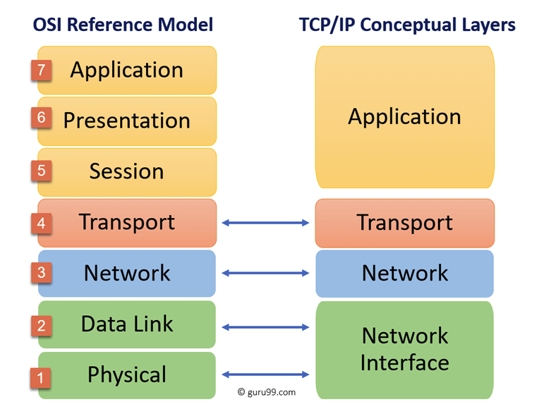
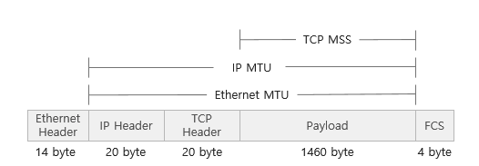
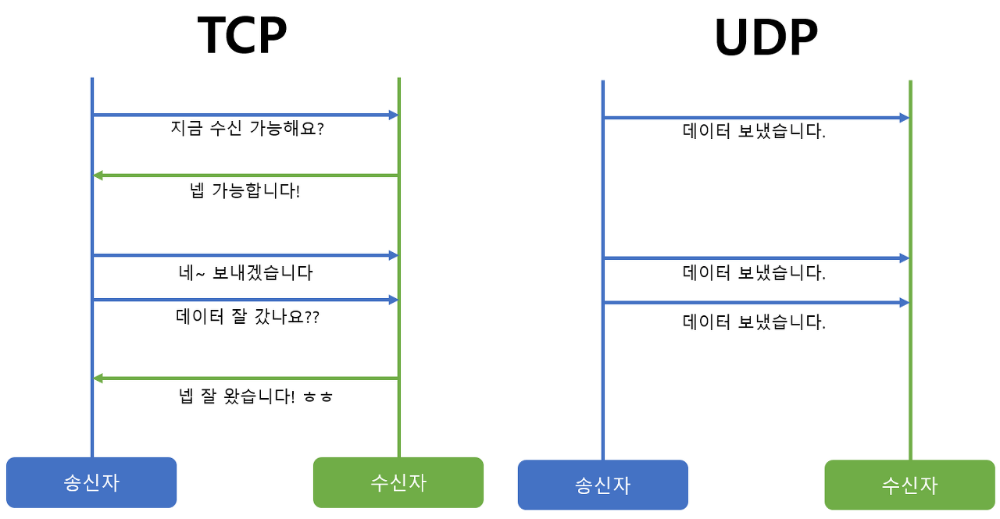

HTTP를 이해하기 위해서는 TCP/IP 프로토콜에 대한 전반적인 이해가 필요하다. 인터넷을 포함한 일반적으로 사용하고 있는 네트워크는 TCP/IP라는 프로토콜에서 움직이기 때문이다.

- 프로토콜: 서로 다른 하드웨어와 운영체제 등을 가지고 서로 통신하기 위해서 필요한 규칙

TCP/IP은 `인터넷 상에서 데이터를 주고 받을 때 쓰는 독립적인 프로토콜의 집합`을 의미한다.

## OSI 7계층과 비교

- OSI 참조 모델은 말그대로 참조 모델일 뿐 실제 사용되는 인터넷 프로토콜은 OSI 참조 모델 7계층 구조를 완전히 따르지는 않는다.
- 인터넷 프로토콜 스택(Internet Protocol Stack)은 현재 대부분 TCP/IP를 따른다.
- TCP/IP는 인터넷 프로토콜 중 가장 중요한 역할을 하는 TCP와 IP의 합성어로 데이터의 흐름 관리, 정확성 확인, 패킷의 목적지 보장을 담당한다.
  - `TCP`: 데이터의 정확성 확인
  - `IP`: 패킷을 목적지까지 전송

출처: [https://www.guru99.com/difference-tcp-ip-vs-osi-model.html](https://www.guru99.com/difference-tcp-ip-vs-osi-model.html)

## TCP/IP 4계층

TCP/IP는 4계층으로 구성된다.

TCP/IP가 계층적으로 구성되어 있음으로 다음과 같은 장점이 있다.

- 독립적이다.
- 각 계층은 계층이 연결되어 있는 부분만 결정되어 있어, 각 계층의 내부는 자유롭게 설계 가능하다.

사진 출처: [https://cheapsslsecurity.com/blog/what-is-the-tcp-model-an-exploration-of-tcp-ip-layers/](https://cheapsslsecurity.com/blog/what-is-the-tcp-model-an-exploration-of-tcp-ip-layers/)

### 애플리케이션 계층(application)

- 유저에게 제공되는 애플리케이션에서 사용하는 통신의 움직임을 결정
- http, dtp, dns, ssh, smtp 등등

### 전송 계층(transport)

- 애플리케이션 계층에 네트워크로 접속되어 있는 2대의 컴퓨터 사이의 데이터 흐름을 제공
- 애플리케이션 계층에서 받은 메시지를 기반으로 `세그먼트` 또는 `데이터그램`으로 데이터를 쪼개고 데이터의 오류가 없다면 순서대로 전달되도록 함
- TCP, UDP

### 인터넷 계층 (network)

- 네트워크 상의 패킷의 이동을 다룸
- 한 노드에서 다른 노드로 전송 계층에서 받은 세그먼트 또는 데이터 그램을 패킷화하여 목적지로 전송하는 역할
- 패킷: 전송하는 데이터의 최소 단위

### 링크 계층(link, data link, network access, network interface)

- 네트워크에 접속하는 하드웨어적인 면을 다룬다.

## TCP/IP 통신 흐름

- 아래 그림과 같이 단계 별로 헤더(Message -> segment/data gram -> packet -> frame/bit)를 붙여 전송하며 이를 `데이터 캡슐화`라고 한다.

- http를 사용한 예시는 아래와 같다.

> 출처: 그림으로 배우는 http & network - 우에노 센  저 / 이병억  역

### 캡슐화

- 송신자가 수신자에게 데이터를 보낼 때 데이터가 각 계층을 지나며 각 계층의 특징들이 담긴 헤더들이 붙여지는 과정
- 예시: 전송계층은 TCP헤더를, 네트워크 계층은 IP주소 헤더를 추가

### 비캡슐화

- 캡슐화의 반대 과정, 수신측에서 각 계층을 거칠 때마다 해당 계층마다 사용한 헤더를 제거하는 과정

## 데이터 단위: PDU(protocol data unit)

- TCP/IP 4계층을 기반으로 설명했을 때 각 계층의 데이터 단위
- 애플리케이션 계층: 메시지
- 전송 계층: 세그먼트(TCP), 데이터 그램(UDP) → 의미는 같지만 사용하는 곳이 다름
- 인터넷 계층: 패킷 ⇒ 세그먼트에 SP와 DP가 포함된 IP헤더가 붙은 형태의 조각
- 링크 계층: 프레임(데이터 링크 계층), 비트(물리 계층)

# MTU와 MSS, PMTUD

## MTU(Maximum Transimssion Unit)

- 네트워크에 연결된 장치가 받아드릴 수 있는 최대 데이터 패킷의 크기
- mtu를 기준으로 데이터는 쪼개져서 패킷화된다.
- Ethernet Frame을 제외한 IP Datagram의 최대 크기

## MSS(Maximum Segment Size

- 데이터의 크기(payload)만 가리킨다.
- MSS = MTU - IP Header 크기 (최소 20 Byte) - TCP Header 크기 (최소 20 Byte)

## 전송계층에서 TCP와 UDP비교

- TCP와 UDP는 4계층인 전송 계층에서 동작

> https://wormwlrm.github.io/2021/09/23/Overview-of-TCP-and-UDP.html

- 두 프로토콜은 모두 패킷을 한 컴퓨터에서 다른 컴퓨터로 전달해주는 IP 프로토콜을 기반으로 구현되어 있지만, 서로 다른 특징을 가지고 있다.

### TCP

- 연결형 서비스로 가상 회선 방식을 제공
- 데이터의 전송 순서 보장
- 데이터의 경계를 구분하지 않음
- 신뢰성 있는 데이터 전송
- UDP보다 전송속도가 느림
- 연결을 설정(3-way handshaking)과 해제(4-way handshaking)

### UDP

- 비연결형 서비스로 데이터그램 방식을 제공
- 비신뢰성
- 데이터의 경계를 구분
- 패킷 오버해드가 적어 네트워크 부하 감소
- 혼잡 제어를 하지 않기 때문에 TCP보다 빠름
- TCP의 handshaking 같은 연결 설정이 없음

### 비교 요약

| TCP                                                           | UDP                                                                      |
| ------------------------------------------------------------- | ------------------------------------------------------------------------ |
| Connection-oriented protocol (연결지향형 프로토콜)            | Connection-less protocol (비 연결지향형 프로토콜)                        |
| 신뢰성 O                                                      | 신뢰성 X                                                                 |
| Connection by byte stream (바이트 스트림을 통한 연결)         | Connection by message stream (메세지 스트림을 통한 연결)                 |
| Congestion / Flow control (혼잡제어, 흐름제어)                | NO Congestion / Flow control (혼잡제어와 흐름제어 지원 X)                |
| Ordered, Lower speed (패킷의 순서 보장, 상대적으로 느림)      | Not ordered, Higher speed (패킷의 순서가 보장되지 않음, 상대적으로 빠름) |
| Reliable data transmission (신뢰성 있는 데이터 전송 - 안정적) | Unreliable data transmission (데이터 전송 보장 X)                        |
| TCP packet : Segment (세그먼트 TCP 패킷)                      | UDP packet : Datagram (데이터그램 UDP 패킷)                              |
| HTTP, Email, File transfer에서 사용                           | DNS, Broadcasting(도메인, 실시간 동영상 서비스에서 사용                  |

### 참고자료

- 그림으로 배우는 http & network - 우에노 센  저 / 이병억
- http완벽가이드 - 데이빗 고울리 , 브라이언 토티 , 마조리 세이어, 세일루 레디, 안슈 아가왈  공저
- - https://www.cloudflare.com/ko-kr/learning/ddos/glossary/user-datagram-protocol-udp/
- https://www.cloudflare.com/ko-kr/learning/ddos/glossary/tcp-ip/
- https://wormwlrm.github.io/2021/09/23/Overview-of-TCP-and-UDP.html#osi-7계층-맛보기
- https://evan-moon.github.io/2019/10/08/what-is-http3/
- https://evan-moon.github.io/2019/11/22/tcp-flow-control-error-control/
