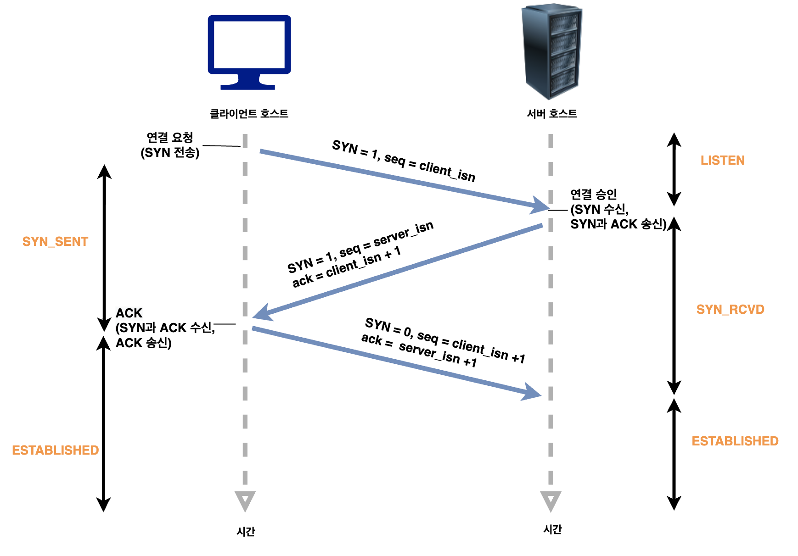
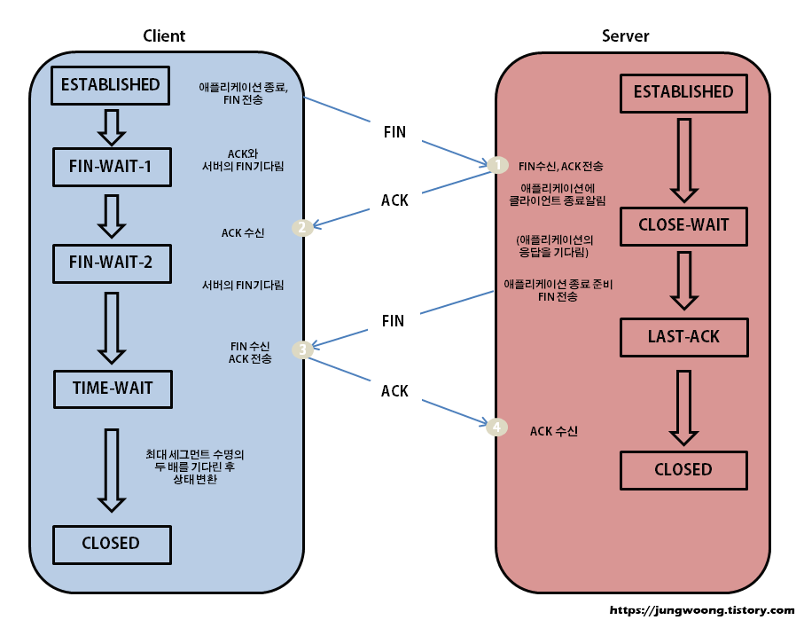

# TCP/IP연결 및 해제 과정

아래와 같이 클라이언트와 서버 간의 연결 설정 과정이 있기 때문에 TCP가 신뢰성이 있다고 한다. UDP는 이러한 과정이 없기 때문에 신뢰성이 없다고 한다.

## TCP의 연결 성립과정: 3 way handshake

### 연결과정

- `SYN`(Synchronize Sequence Number): 연결 확인을 위해 보내는 무작위의 숫자값
- `ACK`(Acknowledgement): Client 혹은 Server로부터 받은 SYN에 1을 더해 SYN을 잘 받았다는 ACK
- `ISN`(Initial sequence numbers) - Client와 Server가 각각 처음으로 생성한 SYN, TCP 기반 데이터 통신에서 각각의 새 연결에 할당된 고유한 32비트 시퀀스 번호

| 상태         | 설명                                                     |
| ------------ | -------------------------------------------------------- |
| CLOSED       | 연결 수립을 시작하기 전의 기본 상태 (연결 없음)          |
| LISTEN       | 포트가 열린 상태로 연결 요청 대기 중                     |
| SYN-SENT     | SYN 요청을 한 상태                                       |
| SYN-RECEIVED | SYN 요청을 받고 상대방의 응답을 기다리는 중              |
| ESTABLISHED  | 연결의 수립이 완료된 상태, 서로 데이터를 교환할 수 있다. |

출처: https://bangu4.tistory.com/74

1. SYN 단계: 클라이언트는 서버에 접속을 요청하는 SYN(a) 패킷을 보낸다.

2. SYN + ACK 단계: 서버는 클라이언트의 SYN 패킷에 대한 요청 수락 응답으로 ACK 패킷(a+1과 클라이언트도 포트를 열어달라는 SYN(b) 패킷을 보낸다.

3. 클라이언트는 ACK(a+1) 패킷과 SYN(b) 패킷을 받고 이에 대한 응답으로 ACK(b+1) 패킷을 보내며 연결이 성립된다.

출처: https://livenow14.tistory.com/57

### 왜 2way가 아니라 3way일까?

`TCP`는 `양방향성 연결`이기 때문에 클라이언트에서 서버에게 자신의 존재를 알리고 패킷을 보낼 수 있는 것처럼 서버에서도 클라이언트에게 자신의 존재를 알리고 패킷을 보낼 수 있다는 신호를 보내야 하기 때문이다.

### SYN의 값이 무작위 수인 이유

- 처음에 클라이언트에서 SYN 패킷을 보낼 때 Sequence Number에는 랜덤한 숫자가 담겨진다.
- Connection을 맺을 때, 사용하는 포트(port)는 유한 범위 내에서 사용하고 시간이 지남에 따라 재사용한다. 따라서 이전에 사용한 포트 번호를 재사용할 가능성이 있다.
- Sequence Number가 순차적인 숫자로 전송된다면 서버는 이전의 Connection으로부터 전송되는 패킷으로 인식할 수 있다. 따라서 이러한 문제를 해결하기 위해 난수로 초기 Sequence Number를 설정한다.

## TCP의 연결 헤제과정: 4 way handshake

### 해제과정

| 상태                | 설명                                                                                                                    |
| ------------------- | ----------------------------------------------------------------------------------------------------------------------- |
| CLOSE               | 연결 수립을 시작하기 전의 기본 상태 (연결 없음)                                                                         |
| ESTABLISHED         | 연결의 수립이 완료된 상태, 서로 데이터를 교환할 수 있다.                                                                |
| CLOSE-WAIT          | 상대방의 FIN(종료 요청)을 받은 상태. 상대방 FIN에 대한 ACK를 보내고 애플리케이션에 종료를 알린다.                       |
| LAST-ACK CLOSE-WAIT | 상태를 처리 후 자신의 FIN요청을 보낸 후 FIN에 대한 ACK를 기다리는 상태.                                                 |
| FIN-WAIT-1          | 자신이 보낸 FIN에 대한 ACK를 기다리거나 상대방의 FIN을 기다린다.                                                        |
| FIN-WAIT-2          | 자신이 보낸 FIN에 대한 ACK를 받았고 상대방의 FIN을 기다린다.                                                            |
| CLOSING             | 상대방의 FIN에 ACK를 보냈지만 자신의 FIN에 대한 ACK를 못받은 상태                                                       |
| TIME-WAIT           | 모든 FIN에 대한 ACK를 받고 연결 종료가 완료된 상태. 새 연결과 겹치지 않도록 일정 시간 동안 기다린 후 CLOSED로 전이한다. |

출처: https://seongonion.tistory.com/74

1. 클라이언트는 서버에게 연결을 종료하겠다는 FIN 패킷을 보낸다.

2. 서버는 클라이언트의 요청(FIN)에 대한 응답으로 ACK 패킷을 보낸다. 처리해야 할 자신의 통신이 끝날 때까지 기다린다.

3. 처리해야 할 모든 통신을 끝마쳤다면 연결을 종료하겠다는 FIN 패킷을 보낸다.

4. 클라이언트는 FIN 패킷에 대한 확인 응답으로 ACK 패킷을 보낸다.

5. 클라이언트의 ACK 패킷을 받은 서버는 소켓 연결을 close 한다.

6. 클라이언트는 아직 서버로부터 받지 못한 데이터가 있을 것을 대비해 기다리는 과정을 거친다.(TIME_WAIT)

### TIME-WAIT

- 먼저 연결을 끊는 (active closer) 쪽에 생성되는 소켓으로, 혹시 모를 패킷 전송 실패에 대비하기 위하여 존재하는 소켓
- 지연 패킷이 발생했을 때 데이터 무결성을 해결하기 위함
- MSL의 2배 만큼 기다린다.
- OS마다 다르다.
- 소켓이 바로 소멸되지 않고 일정 시간 유지되는 상태를 말하며 지연 패킷 등의 문제점을 해결하는데 쓰인다.
- TIME-WAIT이 없다면 패킷의 손실이 발생하거나 통신자 간 연결 해제가 제대로 이루어지지 않을 수 있다
