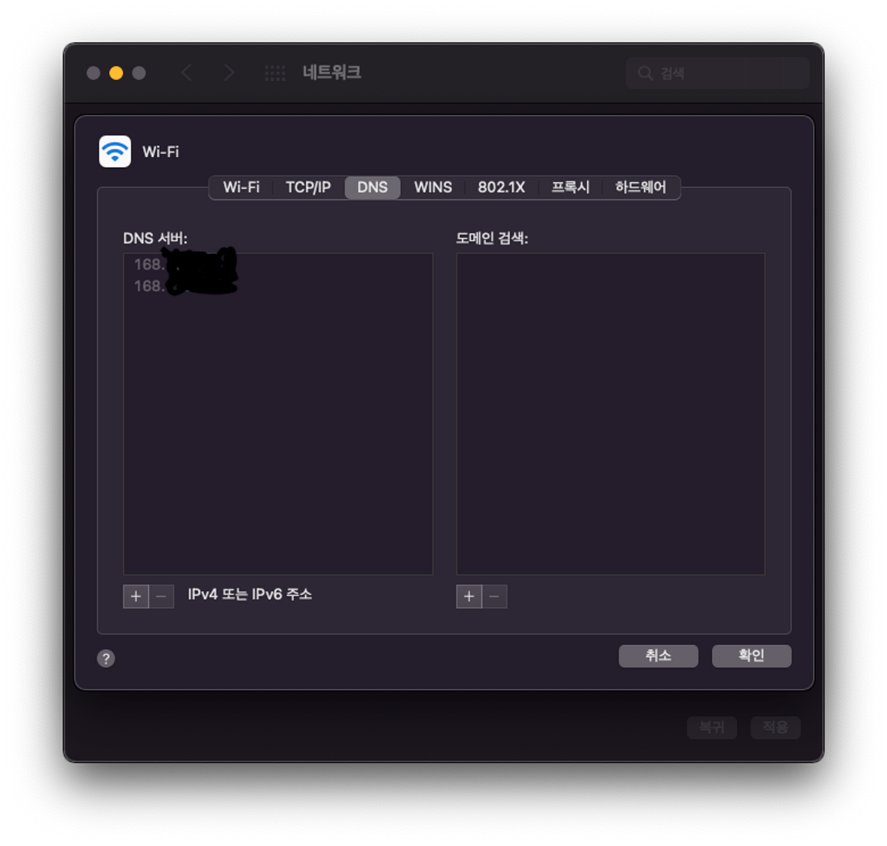

# DNS

웹사이트를 위한 주소록, 브라우저에서 웹 주소를 입력할 때, 브라우저는 그 웹사리트를 검색하기 전에 DNS를 살펴본다.

- 브라우저는 HTTP 메시지를 올바른 장소로 전송하기 위해 그 웹사이트가 있는 서버가 어떤 것인지 찾아야 한다.
- 실제 웹 주소는 문자가 아닌 3.245.217.105 같은 숫자 덩어리. 이러한 IP주소는 웹의 하나뿐인 특정 위치를 나타냄.
- DNS는 기억하기 쉽게 바꾸고, 브라우저에 유저가 입력한 `웹주소를 실제 IP주소에 맞춰 준다.`
- 인터넷의 DNS 시스템은 이름과 숫자 간의 매핑을 관리하여 마치 전화번호부와 같은 기능을 한다. `DNS 서버`는 이름을 IP 주소로 변환하여 도메인 이름을 웹 브라우저에 입력할 때 최종 사용자를 어떤 서버에 연결할 것인지를 제어합니다. 이 요청을 `쿼리`라고 부릅니다.

## 실제 동작

- 브라우저가 OS에게 domain에 대한 ip주소를 요청
- OS에서 DNS서버로 요청. OS에 DNS서버를 이미 등록해둠.(맥북의 경우 시스템 환경설정-네트워크)

- DNS 또한 TCP/IP의 Application layer의 프로토콜임. (53포트사용)
- DNS도 HTTP Request와 비슷하게 도메인이 담긴 쿼리를 도메인 서버로 보냄. 그러면 도메인 서버가 IP주소를 응답함.
- DNS는 Transport layer에서 UDP를 사용.

## 참고자료

- https://aws.amazon.com/ko/route53/what-is-dns/
