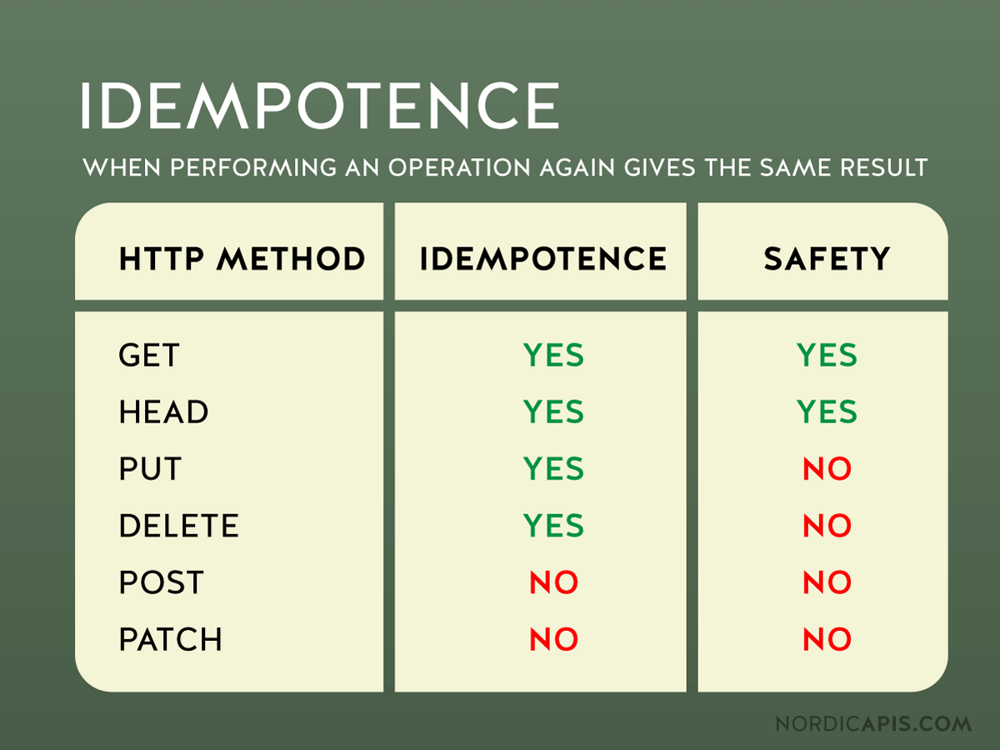

# HTTP

클라이언트-서버 모델을 따르는 프로토콜로 TCP/IP 위에서 동작하며 well-known 포트인 80번 포트를 사용하여 통신한다. 첫번째 표준은 HTTP/1.1이며 이후로 HTTP/2 및 HTTP/3가 등장하였다.

아래 내용은 HTTP/1.1에 관한 내용이다.

## HTTP 프로토콜의 특징

### 리퀘스트(request)와 리스폰스(response)

HTTP는 클라이언트로부터 요청(request)이 시작되며, 해당 요청을 서버가 응답(response)한다.

반드시 클라이언트로부터 통신이 시작되며, 서버 측에서 요청을 받지 않고 응답을 할 수 없다.

### 비-연결 지향 (Connectionless)

클라이언트가 서버에게 리소스를 요청한 후 응답을 받으면 연결을 끊어버리는 특징이다. 연결을 유지하게 되면 서버에 많은 부담을 줄 수 있기 때문에 상당히 많은 클라이언트에게 요청을 받는 웹 서버의 경우 응답을 처리했으면 연결을 끊는다.

이로 인해 서버의 부담을 줄일 수 있지만, 리소스를 요청할 때마다 연결해야 하는 오버헤드 비용이 발생한다. 이를 해결하기 위해선, 요청 헤더의 Connection: keep-alive 속성으로 지속적 연결 상태(Persistent connection)를 유지할 수 있다. 즉, 요청을 할 때마다 연결하지 않고 기존의 연결을 재사용하는 방식이다. HTTP 1.1 부턴 지속적 연결 상태가 기본이며 이를 해제하기 위해선 명시적으로 요청 헤더를 수정해야 한다.

### 무상태성 (Stateless)

HTTP는 상태를 저장하지 않는다.(Stateless). `각각의 요청은 독립적`이다. HTTP 프로토콜 레벨에서 이전에 보냈던 요청과 응답에 대해서 기억하지 않는다.

서버가 클라이언트의 상태를 유지하지 않기 때문에 쇼핑몰의 장바구니 같은 기능처럼 사용자가 일관된 방식으로 페이지와 상호작용할 때 문제가 된다.

HTTP의 핵심은 상태가 없는 것이지만 HTTP 쿠키는 상태가 있는 세션을 만들도록 해준다. 헤더 확장성을 사용하여, 동일한 컨텍스트 또는 동일한 상태를 공유하기 위해 각각의 요청들에 세션을 만들도록 HTTP 쿠키가 추가할 수 있다.

### 요청 URI로 리소스를 식별

HTTP는 URI(Uniform Resource Identifier)를 사용하여 리소스를 지정한다. HTTP 요청 대상을 "리소스"라고 하며 리소스의 특성은 더 이상 정의되지 않는다. 리소스는 문서, 사진 등으로 그 어떤 것이든 될 수 있다.

### 메서드

메서드란 요청 URI로 지정한 리소스에 요청을 보낼 때, 리소스에 어떠한 행동을 하기 원하는지 지시하기 위한 영어 동사 표현이다. `클라이언트가 서버에 요청방법을 정의하는 것으로 주어진 리소스에 수행하길 원하는 행동을 나타낸다.`

- GET : 서버에게 조회할 리소스를 요청한다. (READ, 조회)
- POST : 서버에게 본문(body)에 생성할 데이터를 삽입하여 전송한다. (CREATE, 생성)
- PUT : 서버에게 본문에 수정할 데이터를 삽입하여 전송한다. (UPDATE, 수정)
- DELETE : 서버에게 삭제할 리소스를 요청한다. (DELETE, 삭제)
- PATCH : PUT과 비슷하지만 일부만 수정한다는 점에서 다르다

### HTTP Method 의 멱등성

- 사진 출처: https://nordicapis.com/understanding-idempotency-and-safety-in-api-design/

멱등성이 유지되어야 하는경우, 서버의 상태는 같은 행위를 여러 번 반복하더라도 같은 효과를 가져야 한다.

- POST를 제외하고는 모두(GET, POST, PUT, DELETE) 멱등성이 보장되어야 합니다. (PATCH는 설계에 따라 달라진다.)

올바르게 구현된 REST API 의 GET, HEAD, OPTIONS, PUT, DELETE 메소드는 통계 기록(e.g. 게시물 조회수의 증가 등)을 제외하였을 경우 멱등성이 보장된다.

#### 멱등성을 보장하는 메서드와 이유

- GET : 서버에 존재하는 리소스를 단순히 읽어오기만 하는 메소드이기 때문에 당연히 여러번 수행되어도 결과값은 변하지 않는다.
- PUT : 서버에 존재하는 리소스를 요청에 담긴 내용대로 통째로 대체해버리므로 올바르게 구현하였다면 여러번 수행되어도 결과 값은 변하지 않을 것 이다.
- DELETE : 존재하는 데이터를 삭제한 결과와 이미 존재하지 않은 결과를 삭제하려는 시도에 대한 응답 코드는 서로 다르겠지만, (200 OK 또는 404 NOT FOUND) 서버의 상태 자체는 변하지 않으므로 올바르게 구현되었다면 여러번 수행되어도 멱등성이 보장될 것 이다.

#### 멱등성을 보장하지 않는 메서드와 이유

- POST 메소드가 호출될 때 마다 데이터베이스 등에 요청된 데이터가 추가될 것 이고, 이는 곧 멱등성을 위배함을 알 수 있다. 호출시 마다 서버의 상태가 달라지기 때문이다.
- PATCH는 리소스의 일부에 대하여 변화를 명령할 수 있기 때문에 어떻게 설꼐하느냐에 따라 달라진다.

### 안전한 메소드 (Safe Methods)

안전한 메소드란, 서버의 상태를 변경시키지 않는 HTTP 메소드를 의미한다.

- GET과 같이 조회에 사용되는 메소드를 안전하다고 이야기할 수 있다. 모든 안전한 메소드는 멱등성을 갖지만, 그 역은 성립하지 않는다.
- PUT과 DELET 메소드는 멱등성을 갖는다. 하지만 PUT은 리소스를 수정하고, DELETE는 메소드를 제거하므로 안전한 메소드라고는 이야기할 수 없다.

즉, `멱등성을 갖는 메소드가 서버의 상태를 변경하지 않는다고 오해하면 안된다.` 멱등성을 갖는 메소드도 서버의 상태를 변경시킬 수 있다. 멱등성의 핵심은 "요청에 대한 서버의 상태가 항상 같은가?" 이다.
## HTTP1.x vs HTTP2.0

<!-- !TODO 정리 예정 -->

정리 예정

## 참고자료

- http완벽가이드 - 데이빗 고울리 , 브라이언 토티 , 마조리 세이어, 세일루 레디, 안슈 아가왈  공저
- 그림으로 배우는 http & network - 우에노 센  저 / 이병억  역
- https://developer.mozilla.org/ko/docs/Web/HTTP/Basics_of_HTTP
- https://github.com/brave-people/brave-tech-interview/blob/main/contents/network.md#http11-vs-http20
- https://github.com/baeharam/Must-Know-About-Frontend/blob/main/Notes/network/http.md
