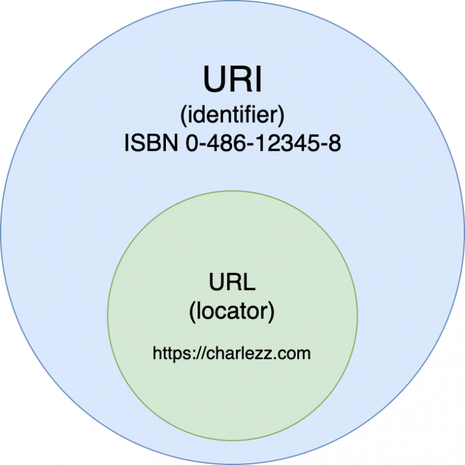

# URI : URL : URN

## URI(Uniform Resource Identifier)

URI는 `통합 자원 식별자`를 의미한다. 다시 말해, `인터넷상의 자원 “자원 자체”를 식별하는 고유한 문자열 시퀀스`이다.

### URI와 URL, URN

URI는 두 가지 주요 부분집합인, URL과 URN으로 구성된 종합적인 개념이다. URN은 현재 그 자원가 어디에 존재하든 상관없이 그 이름만으로 자원를 식별하는 데 비해 URL은 자원가 어디 있는지 설명해서 자원를 식별한다.


- Scheme: 자원에 접근하는 데 사용할 프로토콜. 웹에서는 http 또는 https를 사용
- Host: 접근할 대상(서버)의 호스트 명
- Path: 접근할 대상(서버)의 경로에 대한 상세 정보

## URL(Uniform Resource Locator)

URL은 `인터넷 자원를 가리키는 표준이름`이다. URL은 애플리케이션이 자원에 접근할 방법을 제공한다. 많은 사용자는 브라우저가 그들이 요청하는 자원를 가져오는 데 사용되는 프로토콜과 접근 방식을 모른다.

- 브라우저가 정보를 찾는데 필요한 자원의 위치를 가리킨다.
- URL을 통해 사람이 HTTP 및 다른 프로토콜을 통해 접근할 수 있다.

### ✅ URI와 URL의 차이점

> URI= 식별자, URL=식별자+위치
>
> 출처: [https://www.elancer.co.kr/blog/view?seq=74](https://www.elancer.co.kr/blog/view?seq=74)



사진 출처: [https://www.charlezz.com/?p=44767](https://www.charlezz.com/?p=44767)

예시

- example.com은 URI 이다 자원의 이름만 나타내기 때문
- <https://example.com은> URL이다. 이름과 더불어, 어떻게 도달할 수 있는지 위치까지 함께 나타내기 때문 (프로토콜 ‘https’ 포함)

#### URL은 일종의 URI이다.

- 하위 집합 개념

#### URL은 프로토콜과 결합한 형태

- 어떻게 위치를 찾고 도달할 수 있는지까지 포함되어야 하므로 **URL은 프로토콜 + 이름(또는 번호)**
  의 형태

### 구조

> 당신은 일반적인 우편 메일 주소처럼 URL을 생각할 것이다: 프로토콜은 사용하고 싶은 우편 서비스다, 도메인 이름은 도시나 마을이다, 그리고 포트 우편 번호이다; 경로는 메일이 전달되어야 하는 건물을 나타낸다; 파라미터는 건물 번호와 같은 정보를 나타낸다; 그리고, 마지막으로, 프래그먼트(anchor)는 메일을 받는 실제 사람을 나타낸다.
>
> 출처: <https://developer.mozilla.org/ko/docs/Learn/Common_questions/What_is_a_URL>

- 대부분의 URL 스킴의 문법은 9개 구분으로 나뉜다.

```diff
<스킴>://<사용자 이름>:<비밀번호>@<호스트>:<포트>/<경로>;<파라미터>?<질의>#<프래그먼트>
```

- 이 모든 컴포넌트를 가지는 URL은 거의 없고 `스킴, 호스트, 경로`가 가장 중요하다.

#### 스킴


- 브라우저가 어떤 규약을 사용해야 하는 지를 나타낸다.
- 프로토콜은 컴퓨터 네트워크에서 데이터를 교환하거나 전송하기 위한 방법들의 세트, 서버와 클라이언트 간에 어떤 방법으로 자원에 접근할지 알려주는 통신 규약 중 하나

#### 도메인(호스트)


- URL에서 웹서버의 위치를 지정하는 부분으로 어떤 웹 서버가 요구되는 것인 지를 가리킨다.
- IP주소를 직접 사용할 수도 있지만 도메인 주소가 편하기 때문에 도메인 주소를 주로 사용한다.

#### 포트


- 자원를 호스팅하는 서버가 열어놓은 포트 번호.
- 만약 웹서버가 자원의 접근 하기 위해 표준 HTTP 포트 (HTTP를 위한 80, HTTPS를 위한 443)를 사용한다면, 포트 번호는 보통 생략할 수 있다. 그렇지 않으면 포트 번호는 필수이다.

#### 경로


- 웹서버에서 자원에 대한 경로이다.

#### 파라미터


- 특정 스킴들에서 입력 파라미터를 기술하는 용도로 사용
- **이름/값**의 쌍으로 표현
- 세미콜론(;)으로 구분하여 여러 개 기술 가능

#### 프래그먼트(Anchor)


- 자원의 일부를 가리키는 이름.
- 프래그먼트가 가리키는 지점에 위치된 내용을 보여주기 위해 브라우저에 방향을 알려준다.

## URN(Uniform Resource Name)

[URN은 자원의 위치, 프로토콜, 호스트 등과는 상관없이 각 자원에 이름을 부여한 것](https://terms.naver.com/entry.naver?docId=74838&cid=43667&categoryId=43667)이다. 즉, URL은 어떤 특정 서버에 있는 웹 문서를 가리키지만, URN은 `웹 문서의 물리적인 위치와 상관없이 웹 문서 자체`를 나타낸다.

이처럼 개별 자원에 식별자를 부여하게 되면 해당 정보에 대한 URN은 일정하게 유지되며 자원의 위치, 프로토콜, 호스트와 관계없이 위치를 파악할 수 있다는 장점이 있다. (ex 웹 문서가 다른 웹 서버로 이동하거나 주소가 바뀌는 등 물리적 위치가 변경되더라도 해당 문서를 찾을 수 있다.)

### 참고자료

- http완벽가이드 - 데이빗 고울리 , 브라이언 토티 , 마조리 세이어, 세일루 레디, 안슈 아가왈 공저
- [https://www.elancer.co.kr/blog/view?seq=74](https://www.elancer.co.kr/blog/view?seq=74)
- [https://github.com/baeharam/Must-Know-About-Frontend/blob/main/Notes/network/uri.md](https://github.com/baeharam/Must-Know-About-Frontend/blob/main/Notes/network/uri.md)
- [https://developer.mozilla.org/ko/docs/Learn/Common_questions/What_is_a_URL](https://developer.mozilla.org/ko/docs/Learn/Common_questions/What_is_a_URL)
- [https://stackoverflow.com/questions/4913343/what-is-the-difference-between-uri-url-and-urn](https://stackoverflow.com/questions/4913343/what-is-the-difference-between-uri-url-and-urn)
