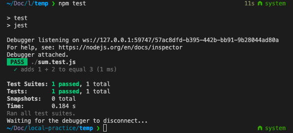

# nodejs with es6 - jest, typescript,nodemon,babel 세팅

nodejs환경에서 typescript, jest를 사용하기 위한 환경 설정을 해봤다.

이번 환경 설정을 하면서 주의해야할 사항은 다음과 같다.

- jest 환경 설정과 개발환경설정을 따로 신경써야한다.
- typescript와 es최신문법을 어떻게 트랜스파일할 것인지 차이점을 알아야 한다.

# 0. babel vs typescript

여러 글을 찾아본 결과 TypeScript 컴파일러와 Babel은 모두 고유한 처리 방식을 가지고 있다. 따라서 소개하는 글마다 다양한 의견이 있으며 어느 하나가 좋다고 느끼기엔 아직 어려운 부분이 많다. 우선 옵션에 대한 간략한 이해와 어떤 툴을 사용할지보다 컴파일러의 역할에 대해 이해할 필요가 있어 보인다.

결론적으로 `@babel-node + @babel/preset-typescript`가 아닌 `ts-node`를 선택했다. 그 이유는 다음과 같다.

- ts-node는 모든 TypeScript 언어 기능을 지원하지만 @babel/preset-typescript는 네임스페이스 및 인라인 모듈을 지원하지 않는다.
- ts-node는 @babel/preset-typescript(예: @babel/plugin-proposal-object-rest-spread) 위에 추가 babel 플러그인이 필요한 다양한 Ecmascript 언어 기능을 즉시 지원한다.
- ts-node는 변환하는 동안 유형 검사를 수행할 수 있지만 @babel/preset-typescript는 유형 정보만 제거하고 입력을 별도로 확인해야 한다.

### 패키지별 간단한 역할

**@babel/node**

- Node.js 커멘드 라인에서 사용하는 명령어를 사용할 수 있게 해준다. 코드의 transpile과 실행을 한 번에 해준다. ( node > babel-node )

**babel-plugin-module-resolver**

- 별칭(alias) 경로를 설정해주는 Babel의 플러그인

**ts-node-dev**

- TS 앱을 컴파일하고 파일이 수정되면 다시 시작합니다. (nodemon + ts-node라고 생각하면 된다)

**ts-node**

- ts-node는 TypeScript를 JavaScript로 변환하므로 사전 컴파일 없이 Node.js에서 TypeScript를 직접 실행할 수 있게 한다.
- 대표적인 기능: 자동 tsconfig.json 구문 분석, 노드 버전과 자동으로 일치, Typechecking (optional), 기본 ESM 로더, 테스트 실행기, 디버거 및 CLI 도구와 통합 등등
- 자세한 옵션 및 설명은 [https://typestrong.org/ts-node/docs/options/](https://typestrong.org/ts-node/docs/)을 참고

**@babel/preset-typescript**

- This is a collection of plugins that enable Babel to transform TypeScript code into JavaScript.

**tsconfig-paths**

- tsconfig.json 내에 paths필드에 명시된 모듈을 호출하게 도와주는 라이브러리

**babel-jest**

- jest를 위한 babel 설정
- 이미 jest-cli를 사용하고 있다면 babel-jest를 추가하면 자동으로 Babel을 사용하여 JavaScript 코드를 컴파일 한다.

**ts-jest**

- jest를 사용하여 TypeScript로 작성된 프로젝트를 테스트할 수 있도록 하는 Jest에 대한 소스 맵 지원이 있는 TypeScript 전처리기(preprocessor)
- 자세한 설명은 [https://github.com/kulshekhar/ts-jest](https://github.com/kulshekhar/ts-jest)를 참고

**@types/jest**

- 사용 중인 Jest 버전에 대해 @types/jest 모듈을 설치할 수도 있다.
- TypeScript로 테스트 코드를 작성할 때 완전한 타입체크(full typing)을 지원한다.
- 자세한 설명은 [https://www.npmjs.com/package/@types/jest](https://www.npmjs.com/package/@types/jest)를 참고

# 1. jest 설치

```bash
npm init -y
npm -i D jest
```

설치 이후 root/sum.js와 root/sum.test.js를 아래와 같이 생성

```jsx
//sum.js
function sum(a, b) {
  return a + b;
}
module.exports = sum;

// sum.test.js
const sum = require('./sum');

test('adds 1 + 2 to equal 3', () => {
  expect(sum(1, 2)).toBe(3);
});
```

packge.json에 다음과 같은 script명령어 추가 후 테스트해보기

```json
{
  "scripts": {
    "test": "jest"
  },
  "devDependencies": {
    "jest": "^28.1.2"
  }
}
```

실행결과



# 2. 테스트환경에서 babel 사용하기 (feat. alias)

테스트환경에서도 commonjs를 활용한 export/import가 아닌 esm를 사용하기 위해 babel를 활용해 es6문법을 사용해보자.

다음과 같은 패키지를 추가 설치해야한다. 주의할 점은 개발환경이 아닌 jest를 위한 환경을 세팅하고 있다는 것이다. (개발환경은 따로 후반에 설정할 예정이다.)

```bash
npm i -D babel-jest @babel/core @babel/preset-env
```

Jest를 설치할 때 `babel-jest` 자동으로 설치되고 프로젝트에 바벨 구성이 존재하는 경우 자동으로 파일을 변환한다. 이 동작을 방지하기위해, 명시적으로 jest.config.js에서 `transform: {}` 옵션을 주어 자동변환을 방지할 수 있다.

babel.config.js 파일을 만들어 옵션 추가한다.

```jsx
// babel.config.js
module.exports = {
  presets: [['@babel/preset-env', { targets: { node: 'current' } }]],
};
```

위의 설명처럼 jest.config.js 파일이 없어도 babel-jest가 알아서 babel 설정을 찾아 변환한다. 하지만 `babel-jest`를 JavaScript 코드의 변환기로 명시적으로 정의하려면 .js 파일을 babel-jest 모듈에 매핑하면 된다.

```jsx
// jest.config.js
module.exports = {
  transform: {
    '\\.[jt]sx?$': 'babel-jest',
  },
};
```

es6 문법으로 파일 수정하기

```jsx
// sum.js
export function sum(a, b) {
  return a + b;
}

// sum.test.js
import { sum } from './sum';

test('adds 1 + 2 to equal 3', () => {
  expect(sum(1, 2)).toBe(3);
});
```

# 3. test환경에서 typescript 적용하기 (feat. alias)

Jest는 `Babel`을 통해 TypeScript를 지원하는 방법과 **ts-jest**를 통해 TypeScript를 지원하는 방법이 있다.

### 주의사항

Babel의 TypeScript 지원은 순전히 변환이므로 Jest는 테스트가 실행될 때 테스트에 대한 타입체크를 실행을하지 않는다. 따서서 타입체크를 원하는 경우 대신 ts-jest를 사용하거나 TypeScript 컴파일러 tsc를 별도로(또는 빌드 프로세스의 일부로) 실행할 수 있다.

나는 이후에 설명한 개발환경세팅에서도 babel이 아닌 ts-node를 사용하므로 ts-jest를 사용했다.

## 3-1. via Babel

다음과 같이 @babel/preset-typescript 플러그인을 통해 Babel이 typescript를 컴파일하게 설정한다.

```bash
npm i -D @babel/preset-typescript
```

```jsx
// babel.config.js
module.exports = {
  presets: [
    ['@babel/preset-env', { targets: { node: 'current' } }],
    '@babel/preset-typescript',
  ],
};
// jest.config.js
module.exports = {
  transform: {
    '\\.[jt]sx?$': 'babel-jest',
  },
};
```

## 3-2. ✅ via ts-jest

다음과 같이 패키지를 설치한다.

```bash
npm i -D ts-jest @types/jest
```

다음과 같이 jest.config.js 설정을 한다.

```jsx
// jest.config.js
module.exports = {
  transform: {
    '\\.[jt]sx?$': 'ts-jest',
  },
};
```

설정 이후 아래처럼 확장자 및 코드 수정 후 test를 실행하면 동작한다.

```tsx
// sum.ts
export function sum(a: number, b: number) {
  return a + b;
}

// sum.test.ts
import { sum } from './sum';

test('adds 1 + 2 to equal 3', () => {
  expect(sum(1, 2)).toBe(3);
});
```

## 3-3. 테스트환경에서 절대경로 설정하기

절대경로를 위해 다음과 같이 jest.config.js를 변경한다.
ts환경에서는 transfrom: { '\\.[jt]sx?$': 'ts-jest'} 으로 설정하면 된다.

```jsx
// jest.config.js
module.exports = {
  transform: {
    '\\.[jt]sx?$': 'babel-jest',
  },
  moduleFileExtensions: ['js', 'json', 'jsx', 'ts', 'tsx', 'json'],
  roots: ['<rootDir>'],
  moduleNameMapper: {
    '@/(.*)': '<rootDir>/src/$1',
  },
};
```

코드 수정후 테스트실행해보기

```jsx
// sum.test.ts
import { sum } from '@/sum';

test('adds 1 + 2 to equal 3', () => {
  expect(sum(1, 2)).toBe(3);
});
```

하지만 우리는 test뿐만 아니라 개발환경에서도 typescript를 쓰기 때문에 개발 환경에 대한 추가 설정이 필요하다.

# 4. 개발환경 tsconfig 세팅 ( feat. alias)

개발환경에서 typescript를 사용하기 위해 다음과 같은 패키지 설치하고 다음과 폴더구조를 설정한다.

```tsx
npm i -D typescript ts-node @types/node nodemon
```

폴더구조

```bash
.
├── src
│   ├── app.ts
│   └── sum.ts
├── test
│   └── sum.test.ts
├── nodemon.json
├── babel.config.js # via Babel일 때 추가
├── jest.config.js
├── tsconfig.json
├── package.json
└── package-lock.json
```

test환경 설정과 마찬가지로 Babel을 활용할 수 있다.

## 4-1. via Babel (절대경로설정까지)

다음과 같은 패키지를 설치한다.

```bash
npm i -D @babel/node babel-plugin-module-resolver
```

이후 babel.config.js에서 다음과 같이 절대경로 세팅을 한다.

```jsx
// babel.config.js
module.exports = {
  presets: [
    ['@babel/preset-env', { targets: { node: 'current' } }],
    '@babel/preset-typescript',
  ],
  plugins: [
    [
      'module-resolver',
      {
        root: ['.'],
        alias: {
          '@': './src',
        },
      },
    ],
  ],
};
```

nodemon 설정

```jsx
// nodemon.json
{
  "watch": ["src", ".env"],
  "ext": "ts",
  "ignore": ["src/**/*.spec.ts"],
  "exec": "babel-node --extensions \".ts\" src/app.ts"
}
```

## 4-2. via ts-node

다음과 같은 패키지를 설치한다.

```bash
npm i -D tsconfig-paths ts-node
```

### ts-node

- TypeScript를 JavaScript로 변환하므로 사전 컴파일 없이 Node.js에서 TypeScript를 직접 실행할 수 있게 한다.
- 대표적인 기능: 자동 tsconfig.json 구문 분석, 노드 버전과 자동으로 일치, Typechecking (optional), 기본 ESM 로더, 테스트 실행기, 디버거 및 CLI 도구와 통합 등등
- 자세한 옵션 및 설명은 [https://typestrong.org/ts-node/docs/options/](https://typestrong.org/ts-node/docs/)을 참고

### tsconfig 생성

```json
{
  "compilerOptions": {
    "types": ["node", "jest"],
    "target": "es5",
    "module": "commonJS",
    "noImplicitAny": true,
    "strictNullChecks": true,
    "baseUrl": ".",
    "outDir": "./dist",
    "paths": {
      "@/*": ["src/*"]
    },
    "forceConsistentCasingInFileNames": true
  },
  "compileOnSave": true,
  "include": ["."]
}
```

위의 설정 중 눈여겨봐야할 설정은 다음과 같다.

- `"types": ["node", "jest"]` ⇒ node 및 jest 유형이 전역적으로 사용 가능하다고 가정하도록 TypeScript에 지시
- `"outDir": "./dist"` ⇒ 컴파일된 파일을 git에 추가하지 않도록 dist폴더로 빼기. (gitignore에 추가하기 위해)
- `"forceConsistentCasingInFileNames": true` ⇒ Mac에서 작업하고 Mac 이외의 다른 장치에 배포하는 경우 많은 어려움을 피할 수 있는 옵션

nodemon 설정

```jsx
// nodemon.json
{
  "watch": ["src", ".env"],
  "ext": "ts",
  "ignore": ["src/**/*.spec.ts"],
  "exec": "ts-node -r tsconfig-paths/register --transpile-only ./src/app.ts"
}
```

## 4-3. 코드 실행

babel 혹은 ts-node 설정이 끝난 후 다음과 같이 코드를 수정한다.

```jsx
// src/sum.ts
export function sum(a: number, b: number) {
  return a + b;
}

// src/app.ts
import { sum } from '@/sum';

console.log(sum(1, 2));
```

설정을 완료했다면 `npm run dev`로 실행해보고 `npm test`로 테스트코드도 실행한다.

## 참고자료

[https://jestjs.io/docs/getting-started](https://jestjs.io/docs/getting-started)

[https://elvanov.com/2524](https://elvanov.com/2524)

[https://yamoo9.gitbook.io/typescript/cli-env/tsconfig](https://yamoo9.gitbook.io/typescript/cli-env/tsconfig)

[https://typestrong.org/ts-node/docs/](https://typestrong.org/ts-node/docs/)

[https://blog.logrocket.com/babel-vs-typescript/](https://blog.logrocket.com/babel-vs-typescript/)

[https://blog.logrocket.com/configuring-nodemon-with-typescript/](https://blog.logrocket.com/configuring-nodemon-with-typescript/)

[https://dev.to/dotorimook/using-absolute-path-import-with-typescript-babel-nodemon-in-your-node-project-ha7](https://dev.to/dotorimook/using-absolute-path-import-with-typescript-babel-nodemon-in-your-node-project-ha7)

[https://typescript-kr.github.io/pages/tutorials/babel-with-typescript.html](https://typescript-kr.github.io/pages/tutorials/babel-with-typescript.html)

[https://learntypescript.dev/12/l2-babel](https://learntypescript.dev/12/l2-babel)
