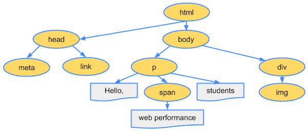

# 브라우저 렌더링 과정 이해하기.

주소창에 www.example.com을 입력하면 네트워크 통신 과정을 거쳐 리소스를 받게 된다. 그렇다면 받아온 리소스는 어떻게 브라우저에 표시되는 걸까?

## 흐름

- 브라우저란?
- 브라우저 렌더링 과정
  - Parsing
  - Style
  - Layout/Reflow
  - Painting
  - Composite
- 레이아웃과 리페인트

## 브라우저란?

웹 브라우저(Web browser) 혹은 브라우저는 웹에서 페이지를 검색하고 표시하며 사용자가 하이퍼링크를 통해 추가 페이지에 접근할 수 있도록 하는 프로그램이다.

[StatCounter 브라우저 통계](https://gs.statcounter.com)에 의하면 2023년 2월 현재 크롬, 사파리, 엣지, 파이어폭스 점유율은 91.57%에 달한다.

### 주요 기능

브라우저의 주요 기능은 `사용자가 선택한 자원을 서버에 요청하고 브라우저에 표시`하는 것이다. 자원은 보통 HTML 문서지만 PDF나 이미지 또는 다른 형태일 수 있다. 자원의 주소는 URI(Uniform Resource Identifier)에 의해 정해진다.

### 브라우저의 기본 구조


> 출처 : https://d2.naver.com/helloworld/59361

- 사용자 인터페이스 : 주소 표시줄, 이전/다음 버튼, 북마크 메뉴 등. 요청한 페이지를 보여주는 창을 제외한 나머지 모든 부분이다.
- 브라우저 엔진 : 사용자 인터페이스와 렌더링 엔진 사이의 동작을 제어.
- 렌더링 엔진 : 요청한 콘텐츠를 표시. 예를 들어 HTML을 요청하면 HTML과 CSS를 파싱하여 화면에 표시함. 브라우저마다 사용하는 렌더링 엔진이 다른데 파이어폭스는 모질라에서 직접 만든 게코(Gecko) 엔진을 사용하고 사파리와 크롬은 웹킷(Webkit) 엔진을 사용한다.
- 통신 : HTTP 요청과 같은 네트워크 호출에 사용됨. 이것은 플랫폼 독립적인 인터페이스이고 각 플랫폼 하부에서 실행됨.
- UI 백엔드 : 콤보 박스와 창 같은 기본적인 장치를 그림. 플랫폼에서 명시하지 않은 일반적인 인터페이스로서, OS 사용자 인터페이스 체계를 사용.
- 자바스크립트 해석기 : 자바스크립트 코드를 해석하고 실행.
- 자료 저장소 : 이 부분은 자료를 저장하는 계층이다. 쿠키를 저장하는 것과 같이 모든 종류의 자원을 하드 디스크에 저장할 필요가 있다. HTML5 명세에는 브라우저가 지원하는 '웹 데이터 베이스'가 정의되어 있다.

## 브라우저 렌더링 과정

3번 렌더링 엔진에서 브라우저의 렌더링을 관리하는데 렌더링의 기본적인 동작 과정은 다음과 같다.


> 출처 : https://d2.naver.com/helloworld/59361

- 렌더링 엔진은 HTML 문서를 파싱하고 "콘텐츠 트리" 내부에서 태그를 DOM 노드로 변환한다. 그 다음 외부 CSS 파일과 함께 포함된 스타일 요소도 파싱한다. 스타일 정보와 HTML 표시 규칙은 "렌더 트리"라고 부르는 또 다른 트리를 생성한다.
- 렌더 트리는 색상 또는 면적과 같은 시각적 속성이 있는 사각형을 포함하고 있는데 정해진 순서대로 화면에 표시된다.
- 렌더 트리 생성이 끝나면 배치(각 노드가 화면의 정확한 위치에 표시)가 시작된다.
- 다음은 UI 백엔드에서 렌더 트리의 각 노드를 가로지르며 형상을 만들어 내는 그리기 과정을 수행한다.

일련의 과정들이 `점진적으로 진행`된다는 것을 아는 것이 중요하다. 렌더링 엔진은 좀 더 나은 사용자 경험을 위해 가능하면 빠르게 내용을 표시하는데 모든 HTML을 파싱할 때까지 기다리지 않고 배치와 그리기 과정을 시작한다. 네트워크로부터 나머지 내용이 전송되기를 기다리는 동시에 받은 내용의 일부를 먼저 화면에 표시하는 것이다.

- Parsing: HTML 파일과 CSS 파일을 파싱해서 각각 Tree를 만든다.
- Style: 두 Tree를 결합하여 Rendering Tree를 만든다.
- Layout: Rendering Tree에서 각 노드의 위치와 크기를 계산한다.
- Paint: 계산된 값을 이용해 각 노드를 화면상의 실제 픽셀로 변환하고, 레이어를 만든다.
- Composite: 레이어를 합성하여 실제 화면에 나타낸다.

### Parsing: HTML 파일과 CSS 파일을 파싱해서 각각 Tree를 만든다.

Parsing 단계는 HTML 파일을 해석하여 DOM(Document Object Model) Tree를 구성하는 단계이다.브라우저가 페이지를 렌더링하기 위해 가장 먼저 받아온 HTML 파일을 해야 한다.

```html
<html>
  <head>
    <meta name="viewport" content="width=device-width,initial-scale=1" />
    <link href="style.css" rel="stylesheet" />
    <title>Critical Path</title>
  </head>
  <body>
    <p>Hello <span>web performance</span> students!</p>
    <div></div>
  </body>
</html>
```



> 참조: https://web.dev/critical-rendering-path-constructing-the-object-model/

파싱 중 HTML에 CSS가 포함되어 있다면 CSSOM(CSS Object Model) Tree 구성 작업도 함께 진행한다.

```css
/* style.css */
body {
  font-size: 16px;
}
p {
  font-weight: bold;
}
span {
  color: red;
}
p span {
  display: none;
}
img {
  float: right;
}
```


> 참조: https://web.dev/critical-rendering-path-constructing-the-object-model/

### Style: 두 Tree를 결합하여 Rendering Tree를 만든다.

Style 단계에서는 Parsing 단계에서 생성된 DOM Tree와 CSSOM Tree를 매칭시켜서 Render Tree를 구성한다. Render Tree는 실제로 화면에 그려질 Tree이다.

예를 들면 Render Tree를 구성할때 visibility: hidden은 요소가 공간을 차지하고, 보이지만 않기 때문에 Render Tree에 포함이 되지만, display: none 의 경우 Render Tree에서 제외된다.


> 참조: https://web.dev/critical-rendering-path-render-tree-construction/

### Layout: Rendering Tree에서 각 노드의 위치와 크기를 계산한다.

Layout 단계에서는 Render Tree를 화면에 어떻게 배치해야 할 것인지 노드의 정확한 위치와 크기를 계산한다.

루트부터 노드를 순회하면서 노드의 정확한 크기와 위치를 계산하고 Render Tree에 반영한다. 만약 CSS에서 크기 값을 %로 지정하였다면, 레이아웃 단계를 거친 후 % 값은 계산되고 측정 가능한 픽셀 단위로 변환된다.

### Paint: 계산된 값을 이용해 각 노드를 화면상의 실제 픽셀로 변환하고, 레이어를 만든다.

Paint 단계에서는 Layout 단계에서 계산된 값을 이용해 Render Tree의 각 노드를 화면상의 실제 픽셀로 변환한다. 이때 픽셀로 변환된 결과는 하나의 레이어가 아니라 여러 개의 레이어로 관리된다.

스타일이 복잡할수록 Paint 시간도 늘어난다. 예를 들어, 단색 배경의 경우 시간과 작업이 적게 필요하지만, 그림자 효과는 시간과 작업이 더 많이 필요하다.

### Composite: 레이어를 합성하여 실제 화면에 나타낸다.

Composite 단계에서는 Paint 단계에서 생성된 레이어를 합성하여 실제 화면에 나타낸다. 우리는 화면에서 웹 페이지를 볼 수 있다.

## 레이아웃과 리페인트

브라우저 로딩 과정 중 스타일 이후의 과정(스타일 -> 레이아웃 -> 페인트 -> 합성)을 렌더링이라고 하는데, 이 렌더링 과정은 상황에 따라 반복하여 발생할 수 있다.

스타일 단계에서 구성되는 `Render Tree는 자바스크립트에 의해 DOM Tree, CSSOM Tree가 변경될 때 다시 재구성`된다. DOM이 추가/삭제되거나 요소에 기하적인 영향(높이, 넓이, 위치)을 주는 CSS 속성값을 변경하는 경우, 렌더 Tree가 다시 재구성된다.

### 레이아웃(리플로우)

레이아웃(리플로우)는 레이아웃부터 이후 과정(레이아웃 -> 페인트 -> 합성)을 다시 수행하는 과정을 말한다.


> 참조: https://web.dev/rendering-performance/

### 리페인트

리페인트는 페인트부터 수행하는 과정을 말한다. 레이아웃은 요소에 기하적인 영향을 주는 CSS 속성값을 변경할 때 발생한다고 하였는데, 반대로 리페인트는 영향을 주지 않는 CSS 속성값을 변경하면 레이아웃 과정을 건너뛴다.


> 참조: https://web.dev/rendering-performance/

### 레이아웃과 리페인트 차이

- 레이아웃이 일어나면 전체 픽셀을 다시 계산해야 하므로 부하가 크다.
- 리페인트는 이미 계산된 픽셀값을 이용해 화면을 그리기 때문에 레이아웃에 비해 부하가 적다.
- css속성마다 레이아웃, 리페인트 여부를 확인할 수 있는 사이트 : https://csstriggers.com

## 참고자료

- https://tecoble.techcourse.co.kr/post/2021-10-24-browser-rendering/
- https://d2.naver.com/helloworld/59361
- https://ui.toast.com/fe-guide/ko_PERFORMANCE
- https://developer.mozilla.org/ko/docs/Glossary/Browser
