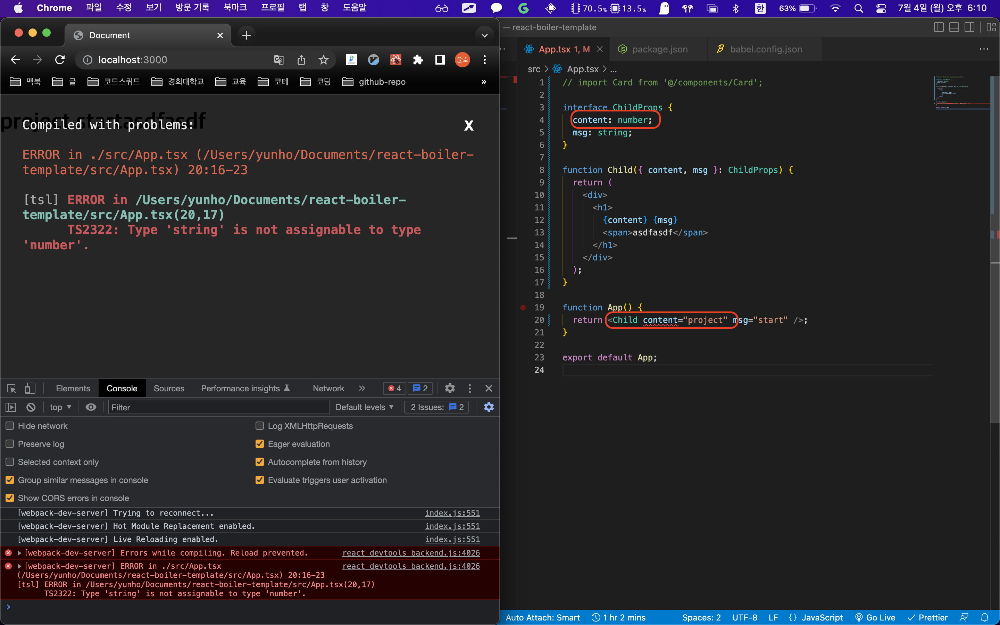
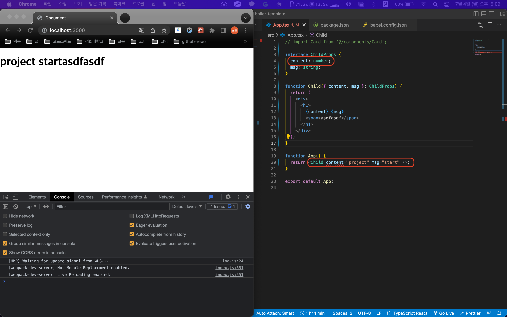

# babel-loader vs ts-loader

publish status: 노션
분야: webpack
생성시간: July 4, 2022 5:58 PM
업데이트해야되니?: No
정리중: 정리중
최종수정시간: July 4, 2022 6:21 PM
키워드: babel-loader, ts-loader

## 요약

> Warning
> `ts-loader` 는 TypeScript 컴파일러인 `tsc`를 사용하고, `tsconfig.json`의 설정을 따릅니다. `[모듈을](https://www.typescriptlang.org/tsconfig#module)`"CommonJS"로 설정하지 않도록 주의하세요. 안그러면 webpack이 [코드 tree-shake를](https://webpack.kr/guides/tree-shaking) 할 수 없습니다.
> 이미 `[babel-loader`를](https://github.com/babel/babel-loader) 사용하여 코드를 트랜스파일 하는 경우라면 `[@babel/preset-typescript](https://babeljs.io/docs/en/babel-preset-typescript)`를 사용하여 Babel이 추가 로더를 사용하는 대신 JavaScript와 TypeScript 파일을 모두 처리하도록 합니다. `ts-loader`와 달리, 기본 `[@babel/plugin-transform-typescript](https://babeljs.io/docs/en/babel-plugin-transform-typescript)`

[webpack 공식문서 설명](https://webpack.kr/guides/typescript/#loader)

# ts-loader 사용

모든 구문을 파악, 타입들을 체크해가면서 빌드를 진행

**장점**

- 강력한 타입체크

**단점**

- 빌드시간이 길다.
- 타입에러가 있을 시 빌드가 불가하다.
- 핫 모듈 리플레이스먼트(HMR)를 지원하지 않는다. `⇒ 확인하지 못했다. 직접 비교했을 때 차이를 파익하지 못했다.` (cf> [Hot Module Replacement](https://webpack.kr/guides/hot-module-replacement/): 모든 종류의 모듈을 새로고침 할 필요 없이 런타임에 업데이트할 수 있는 개발전용 모드)
- 자동 폴리필을 사용할 수 없습니다.

**예시**

- 아래 사진처럼 타입이 다르면 앱이 실행되지 않는다.

  

## babel-loader 사용

type과 관련된 구문을 무시(제거)한 채 빌드를 진행

장점

- 빌드시간이 짧다
- babel의 다양한 플러그인을 사용할 수 있다.
- 사용자 지정 재생성 런타임과 core-js가 있는 폴리필이 포함

단점

- 약한 타입체크로 타입스크립트의 장점을 살리지 못한다.

예시

- 아래 사진과 같이 content의 타입이 올바르지 않아 빨간 줄이 그어지지만 앱은 정상적으로 동작한다.

### 비교

`개발환경`에서는 정확한 타입체크를 위해 ts-loader를 쓰고있고, `운영환경`에서는 빠른 빌드와 바벨의 특화된 설정들을 사용하기위해 babel-loader를 사용하고있다.

아직 HMR관련해서 차이는 파악하지 못했다.

[babel-loader와 ts-loader의 빌드 결과가 다른 현상](https://jeonghwan-kim.github.io/dev/2021/03/08/babel-typescript.html)

[Webpack typescript loader](https://egas.tistory.com/145)

[@babel/preset-typescript vs ts-loader | npm trends](https://www.npmtrends.com/@babel/preset-typescript-vs-ts-loader)

[바벨과 타입스크립트의 아름다운 결혼](https://ui.toast.com/weekly-pick/ko_20181220)

[typescript 번들링](https://velog.io/@ginameee/typescript-%EB%B2%88%EB%93%A4%EB%A7%81)

[Babel vs. TypeScript in 2022](https://blog.bitsrc.io/babel-vs-typescript-in-2022-b8e859a9fefc)
