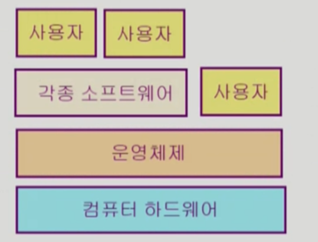
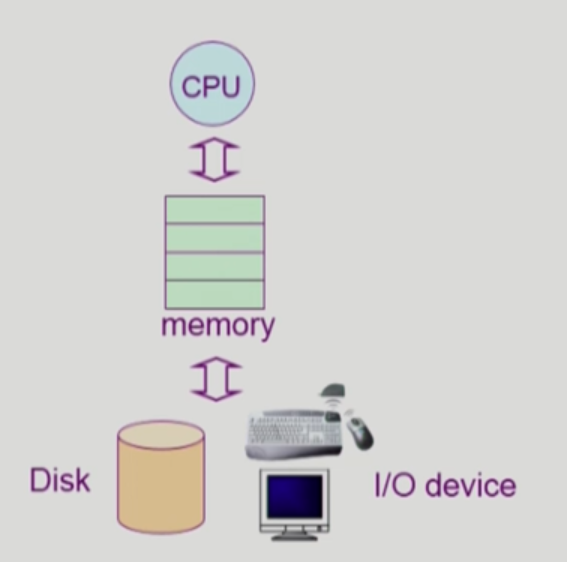

# Introduction to Operating Systems

## 핵심 질문

컴퓨터에서 운영체제의 역할은 무엇일까?

컴퓨터 하드웨어와 각종 소프트웨어, 사용자를 연결해주는 장치이다. 좁은 의미의 운영체제는 커널(운영체제의 핵심부분으로 메모리에 상주하는 부분)을 의미하며, 넓은 의미의 운영체제는 커널 뿐만 아니라 각종 주변 시스템 유틸리티를 포함한다. 

운영체제의 목적은 무엇일까?

운영체제는 프로세서, 기억장치, 입출력 장치 등의 자원을 효율적으로 관리한다. 또한, 사용자가 편리하게 사용할 수 있는 환경을 제공한다. 

운영체제의 구조

운영체제는 크게, cpu, memeory, disk, i/o device로 구성된다. cpu 스케줄링이란 cpu가 제한적일 때, 여러 프로세스들이 cpu를 효율적으로 나누어 사용할 수 있도록 관리하는 기술을 의미한다. memeory 관리란 한정된 메모리를 어떻게 분할해서 쓰는가애 대한 기술이다. 디스크 관리란 디스크에 파일을 어떻게 보관하고, 어떤 방식으로 파일을 읽을지에 관한 기술이다. I/O 관리는 다른 입출력장치와 컴퓨터간 정보를 주고 받는 방법에 대한 기술이다. 

## 운영체제(Operating System, OS)란?

컴퓨터 하드웨어 바로 위에 설치되어 사용자 및 다른 모든 소프트웨어와 하드웨어를 연결하는 소프트웨어 계층

→ 하드웨어와 어떻게 인터렉션을 해야 하는가?

→ 사용자와 어떻게 인터렉션을 해야 하는가?

### 좁은 의미의 운영체제

- = 커널
- 메모리에 상주하는 운영체제의 부분

### 넓은 의미의 운영체제

- 커널 뿐만 아니라 각종 주변 시스템 유틸리티를 포함한 개념
- 필요할 때 메모리에 올라가는 별도의 프로그램

## 운영체제의 목적

### 1. 사용자가 컴퓨터 시스템을 편리하게 사용할 수 있는 환경 제공

- 동시 사용자/ 프로그램들이 각각 독자적 컴퓨터에서 수행되는 것 같은 가상환경을 제공
- 하드웨어를 직접 다루는 복잡한 부분을 운영체제가 대행

### 2. 컴퓨터 시스템의 자원(resource)을 효율적으로 관리

- 자원(프로세서(cpu), 기억장치(memory), 입출력 장치 등)의 효율적 관리
  - 사용자간의 형평성 있는 자원 분배
  - 주어진 자원으로 최대한의 성능을 내도록 한다.
- 실행중인 프로그램들에게 짧은 시간씩 CPU를 번갈아 할당
- 실행중인 프로그램들에 메모리 공간을 적절히 분배
- 사용자 및 운영체제 자신의 보호
- 프로세스, 파일, 메시지 등을 관리

## 운영체제의 분류

우리는 현재 주로 다중 작업, 다중 사용자, 시분할 방식을 지원하는 운영체제를 사용한다.

### `동시 작업 가능 여부`

---

### 1. 단일 작업

한 번에 하나의 작업만 처리

- MS-DOS 프롬포트 상에서는 한 명령의 수행을 끝내기 전에 다른 명령을 수행시킬 수 없다.

### 2. 다중 작업

동시에 두 개 이상의 작업 처리

- unix, ms windows 등, 한 명령의 수행이 끝나기 전에 다른 명령이나 프로그램 실행 가능

### `사용자의 수`

---

동시 접근 여부

### 1. 단일 사용자

- MS-DOS, windows

### 2. 다중 사용자

- unix, NT server

### `처리 방식`

---

### 1. 일괄처리(batch processing)

- 작업 요청의 일정량을 모아서 한 번에 처리
- 작업이 완전 종료될 때까지 기다려야 한다.

### 2. 시분할

- 여러 작업을 수행할 때 컴퓨터 처리 능력을 일정한 시간 단위로 분할하여 사용
- 일과 처리 시스셈에 비해 짧은 응답 시간을 가진다.
- interactive하다.

### 3. 실시간

- 정해진 시간 안에 어떠한 일이 반드시 종료됨이 보장되어야하는 실시간 시스템을 위한 OS
- ex) 원자로/공장 제어, 미사일 제어, 반도체 장비 등등
- 실시간 시스템의 개념 확장
  - 경성 실시간 시스템 (hard realtime system)
  - 연성 실시간 시스템 (soft realtime system)

## 운영체제의 구조

### CPU 스케줄링

어떤 프로그램에게 cpu를 할당한 것인가?

CPU가 제한적일 때, 하나의 프로그램이 cpu를 점유하고 있으면 다른 프로그램이 실행되지 않고 기다려야한다. 따라서 ,여러 프로세스들이 CPU를 효율적으로 나누어 사용할 수 있도록 관리해야한다. CPU스케줄링의 목표는 효율성과 특정 프로세스가 불이익 받지 않도록 하는 것이다.

### 메모리 관리

메모리는 CPU가 직접 접근할 수 있는 컴퓨터 내부의 기억 장치

한정된 메모리를 어떻게 쪼개 쓰지? 메모리가 한정되어 있을 때, 매모리를 어떻게 분배할 것인가?

cpu에서 프로그램이 실행될려면 실행에 필요한 부분이 메모리에 있어야하는데 메모리를 지나치게 조금씩만 가지고 있으면 디스크에서 읽어와야 한다. (느림)

### 디스크관리

디스크에 파일을 어떻게 보관하지?

어떻게 하면 움직임을 최소화하면서 빠르게 많은 일을 할 수 있을까? 엘리베이터와 비슷하다. 엘리베이터가 1층에서 100층가지 기다리가 도중에 15층, 50층에 멈춰서 사람을 태울 수 있듯이, 디크스 헤더도 읽으려는 파일의 위치로 가는 도중 새로운 파일 리딩 요청이 들어오면 효율적인 경로로 수행한다.

### 입출력관리

각기 다른 입출력장치와 컴퓨터 간에 어떻게 정보를 주고 받지?

입출력 기기들은 cpu에 비해 상당히 느리기 때문에 둘 사이의 관리가 필요하다.

### 프로세스 관리

프로세의 생성과 삭제, 자원 할당 및 반환, 프로세스 간 협력
