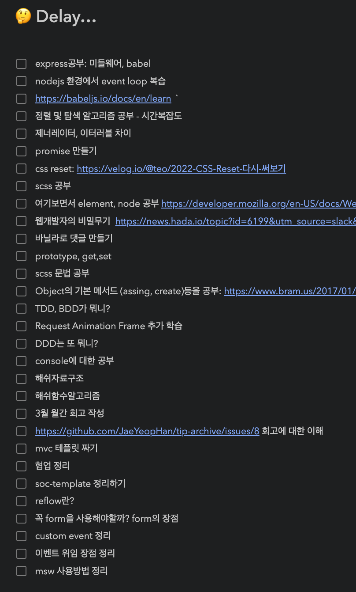

# 4월 3주차 주간회고

> 지난 2주를 돌아봤을 때, 투자한 시간 대비 코드량이 많지 않다. 코드량 뿐만 아니라 학습량(정리 노트)도 많지 않다. 코드스쿼드 토이 프로젝트를 시작하면서 집중도 있게 공부했고, 투자한 시간도 더 많았는데 눈에 보이는 결과가 적어서 아쉽다.

코드 스쿼드에서 진행하는 첫 프로젝트가 끝났다.  간단한 투두리스트 만들기였지만 팀원과 개발환경을 함께 세팅하고, 페어로 진행하면서 미션을  마무리하지 못했다. 다행이 같이한 팀원도 미션 결과보다는 과정이 더 중요하다고 생각하셔서 결과보다는 미션을 진행하면서 겪었던 어려움과 그 어려움을 어떻게 해결했는지에 집중할 수 있었다.

코드 스쿼드하면서 학습한 git flow 및 브랜치 전략와 github 협업 방법들을 코넥트 프로젝트에서도 적용해봤다. 이전엔 노션에 따로 정리하기로했지만 계획한 것처럼 노션에 꼼꼼히 정리하기 어려웠고 백과 프론트 사이에 진행과정을 공유하기 어려웠다. notion도 좋은 협업툴이지만, 이전까지 활용을 제대로 못했으니까 이번 기회에 github를 활용해보는 것도 좋은 경험이 될 것 같다.

2주 동안 협업에 관한 고민을 주로 했다. 코드스쿼드도 그렇고, 코넥트 프로젝트도 그렇고 ‘협업'이라는 두루뭉실한 단어를 알아가는 단계였다. 기존에 해봤던 방법들이 있거나, 개발 문화가 정착된 팀이라면 조금 더 논의가 수월했을 수도 있지만 이전까지 혼자 코딩하다가 이제 막 다른 사람과 같이 코딩하려고 하니 논의가 오래걸렸다. 무엇보다 나 혼자 설계하고, 정리할 때와 다르게 팀원과 같이 설계하고 같이 정리하다보니 어려움이 많았다. 내 생각을 전달하고, 다른 사람의 생각을 이해해기가 이렇게 어려운 일이구나 다시 한 번 느꼈다. 서로 생각을 명확히 전달했어도, 이해하고 프로젝트에 적용하는 일은 또 달랐다.   내 의견을 정확히 전달하는 능력?과 다른 사람의 말을 잘 이해하는 능력?이라고 해야할까, 다른 사람 코드도 자주보면서 코드를 보는 능력도 길러야겠다.

팀 프로젝트를 하면서 분명 공부한 시간도 많고, 집중도 있게 시간을 보냈다고 생각했는데 생각보다 결과가 없었다. 오히려 공부할 키워드가 다른 주에 비해 많이 늘었다.  팀원과 의견을 나누기만하고 정리를 따로 안해서 그런걸까, 나중에 공부해봐야지 하고 미룬 키워드만 늘었다.  팀 프로젝트하면서 새로 알게 된 사실이나 몰랐던 키워드를 모아두고, 팀 프로젝트 시간이 끝나면 공부하려고 했는데 추가 공부는 커녕 팀 프로젝트 때 뭘 했는지 정리할 시간도 챙기지 못했다. 다음주에는 미뤄둔 키워드를 학습하고, <아침-오전-오후-저녁> 이런 식으로 특정 시간 단위로 뭘 했는지 정리하는 시간을 가져봐야겠다.

## Ⓜ️ 코드 스쿼드

> webpack, 협업

바닐라 공부를 어느 정도로 유지할까? 알고리즘과 자료구조 공부처럼 꾸준히 토이 프로젝트를 시도해 봐야겠다.

## Ⓜ️ 코넥트

> 모킹, hooks, 최적화

모킹을 어떻게 할까? 이전까지 그냥 json파일을 fetch 요청했는데 주소 설정에서 어려움을 겪었다. 서버랑 연결해도 별다른 수정 없이 스크립트 명령어로만 구분할 수 있도록 하게 공부해야봐야겠다.
