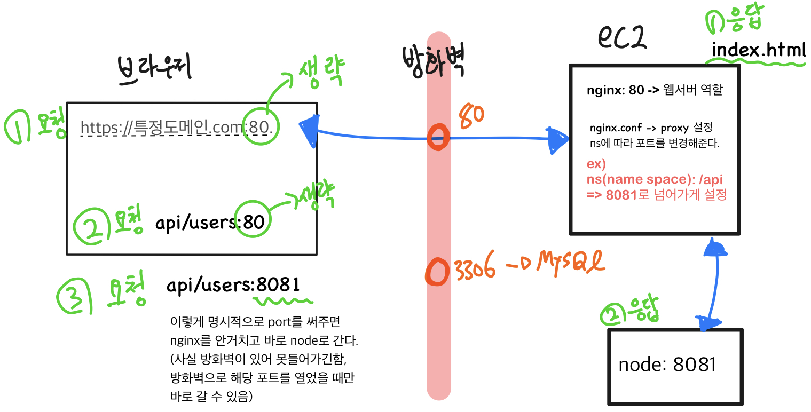

# 20220729

<details>
<summary>시간대별 정리</summary>

### 아침

회고작성

### 오전

ts 브라우저 webpack세팅

### 오후

nginx 및 ec2 동작과정

분리배포 github actions

체크인 스터디 피어세선

### 저녁

댓글 컴포넌트 리팩토링

</details>
<br>

# ts 브라우저 webpack세팅

연결리스트 구현한 코드를 터미널보다는 브라우저에서 동작하는 UI로 input값을 받는 토이프로젝트로 구현하고 싶어서 typescript-webpack 환경을 설정했다.

스타일은 프레임워크 쓰려고 알아보는중..

# nginx 및 ec2 동작과정

[노션정리 - Nginx](https://www.notion.so/nginx-6c8f5ac804f441b8ae7bb928950430fd)

웹 서버이면서 리버스 프록시, 로드 벨런서, 요청에 대해 이벤트 기반 구조로 응답하고 http 캐시로 쓰일 수 있는 소프트웨어다.

다른 기능은 아직 효과를 이해하기 어려웠지만 리버스 프록시는 이해하고 적용해봤다.

### 사용 예시

하나의 ec2에서 서비스를 배포한다고 했을 때, 다음과 같이 설정해서 Nginx + React (프론트엔드)를 실행하고 Node.js + express (백엔드)를 실행하여 서비스 하기.



**요청1**

브라우저 url에 사용자가 특정 주소를 입력 (80포트는 생략) → nginx에서 index.html을 줌 → 브라우저에 렌더링

**요청2**

브라우저에서 api/users로 요청(80포트 생략) → Nginx에서 ns(name space)에 따라 특정 포트로 들어가게 설정한 프록시에 따라 node서버로 이동 → 응답

**요청3**

이렇게 명시적으로 port를 써주면 nginx를 안거치고 바로 node로 간다.

하지만 방화벽이 있어 못들어간다. 방화벽으로 해당 포트를 열었을 때만 바로 갈 수 있다.

**nginx.conf예시**

```bash
server {
    listen 80;

    location / { # 프론트 접근
        root /home/ec2-user/***/build;
        index index.html index.htm;
        try_files $uri $uri/ /index.html;
    }

    # node api reverse proxy
    location /api/ { # api로 시작하는 주소는 백 프로그램이 돌고 있는 포트로 전달
        proxy_pass http://localhost:9090/api/;
    }
}
```

### s3 vs ngnix 어느 걸로 프론트서버를 돌릴까?

잘 모르겠다.

# 분리배포 github actions

현재 구현한 하나의 ec2에서 프론트코드와 백엔드코드가 같이 있는 github레포지토리를 배포할 때 다음과 같은 문제가 있다고 생각했다.

- 프론트 코드를 변경 후 deploy브랜치 push하면 변경하지 않은 백 코드도 다시 빌드
- 반대의 경우도 마찬가지

다음과 같은 github action 스크립트로 해결할 수 있다고 하는데 아직 적용하진 못했다.

```yaml
on:
  push: # 적용될 액션
    branches: develop # 적용될 브랜치
    paths:
      - 'frontend/**' # workflow에서 적용될 path

defaults:
  run:
    working-directory: ./frontend # workflow에서 default working directory
```

# 코넥트

## 1. useAxios 업데이트

현재 get요청만 되게 되어있다. axiosinstance를 받아서 사용하지만 hooks의 특성상 callback함수안에서 선언할 수 없고 함수형 컴포넌트 body에 선언해야한다. 그러다보니 기존 코드로 사용자 액션에 의해 발생하는 fetch요청을 수행하기 어려웠다.

우선 댓글 컴포넌트를 위한 useAxios를 만들어봤다.

여러 useAxios를 선언하지 않고 하나의 useAxios를 사용하도록 수정했다. 최초 get요청은 하고 이후 수정/삭제/추가 로직이 있을 때마다 자동으로 get요청이 요청되도록 수정했다.

## 2. 비슷한 구조의 반복되는 컴포넌트를 어떻게 관리할까?

### 이전

`비슷한 구조(형태)`가 반복되면 컴포넌트 내부에서 분기처리했다. 아래 구조에서 예를 들면, 대댓글 목록을 위해 CommentList를 반복해서 사용했다.

댓글 수정,추가를 위한 Form은 하나의 Form에서 parentId, isCreate과 같은 변수를 넘겨받아서 구분했다.

```bash
.
├── Comment.jsx
├── CommentList.jsx
├── CommentForm.jsx
├── index.jsx
└── style.js
```

### 이후

`데이터를 기준으로 컴포넌트를 구분`했다. 비슷한 형태라도 내부 데이터 성격이 다르다면 별도의 컴포넌트를 만들었다.

관리해야하는 컴포넌트 수는 많아졌지만 컴포넌트 내부의 분기처리가 줄어들어 코드는 깔끔해졌다.

```bash
.
├── CommentElement
│   ├── Nested.CommentElement.jsx
│   └── Root.CommentElement.jsx
├── CommentForm
│   ├── Create.Reply.CommentForm.jsx
│   ├── Create.Root.CommentForm.jsx
│   ├── Edit.Reply.CommentForm.jsx
│   └── Edit.Root.CommentForm.jsx
├── CommentList
│   ├── Nested.CommentList.jsx
│   └── Root.CommentList.jsx
├── index.jsx
└── style.js
```
